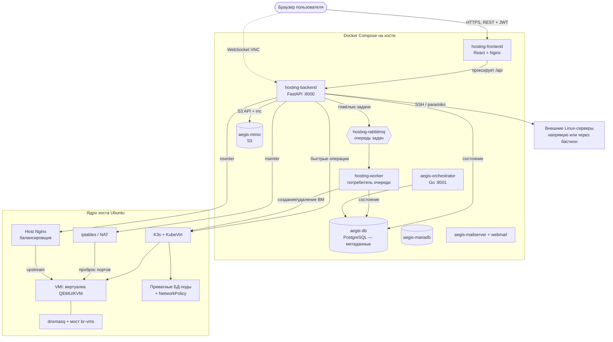

# Как устроен ByteBurners Hosting — карта взаимодействий

Этот документ объясняет **как компоненты общаются между собой**: кто кому шлёт запросы,
где хранятся данные, как проходит запрос от кнопки в браузере до реальной виртуалки.
Дополняет [README.md](README.md) (установка) и [DESIGN.md](DESIGN.md) (внешний вид).

---

## 1. Компоненты и кто с кем разговаривает



Кратко о ролях:

| Компонент | Что делает | С кем общается |
|---|---|---|
| **frontend** | React-панель, отдаётся через Nginx | Браузер → `/api` проксирует в backend |
| **backend (FastAPI)** | Вся логика, авторизация, API | K3s, RabbitMQ, PostgreSQL, MinIO, host nginx/iptables, внешние серверы |
| **worker** | Выполняет долгие задачи из очереди | RabbitMQ → K3s → PostgreSQL |
| **RabbitMQ** | Очередь `vm_tasks` — развязывает API и тяжёлые операции | backend (пишет), worker (читает) |
| **PostgreSQL `aegis-db`** | Метаданные: пользователи, ВМ, БД, бакеты, диски, серверы | backend, worker, orchestrator |
| **MinIO** | S3-хранилище пользователей | backend (создаёт бакеты/ключи через `mc`) |
| **K3s + KubeVirt** | Запускает ВМ как поды, приватные БД-поды | backend, worker |
| **Host Nginx / iptables / dnsmasq** | Балансировка, проброс портов, DHCP для ВМ | backend через `nsenter` в неймспейс хоста |

---

## 2. Ключевой приём: backend управляет ХОСТОМ через `nsenter`

Контейнер backend запущен как `privileged`, `network_mode: host`, `pid: host`.
Благодаря этому он через `nsenter --target 1` выполняет команды **в неймспейсе хоста** —
правит `iptables`, конфиги `/etc/nginx/conf.d`, перезагружает nginx. То есть «панель в контейнере»
реально настраивает сеть физического сервера.

> ⚠️ Обратная сторона: компрометация backend = root на хосте. Поэтому все места, куда
> подставляются пользовательские значения (IP файрвола, имена пулов), строго валидируются —
> см. [раздел 6](#6-модель-безопасности).

---

## 3. Потоки запросов (жизненные циклы)

### 3.1 Вход в панель
```
Браузер → POST /api/auth/login (логин+пароль)
  backend: verify_password (PBKDF2) → create_access_token (HMAC-подпись, ~JWT)
  ← access_token сохраняется в localStorage
Далее каждый запрос: main.jsx подставляет заголовок Authorization: Bearer <token>
  backend: get_current_user декодирует токен → находит пользователя
```
Защита от брутфорса: 5 неудач с одного IP за 5 минут → 429.

### 3.2 Создание виртуальной машины (асинхронно)
```
Браузер → POST /api/vms  (get_current_user + проверка квот)
  backend: пишет строку VMTask (status=Pending) в PostgreSQL
  backend: publish_task("vm_tasks", {...}) → RabbitMQ        ← API сразу отвечает
  ─────────────────────────────────────────────
  worker: читает задачу → generate_linux/windows_manifest
  worker: k8s.create_vm_from_manifest → KubeVirt поднимает VMI
  worker: status=Running в PostgreSQL
Фронтенд каждые 5 сек опрашивает GET /api/vms и видит смену статуса.
```

### 3.3 Как ВМ становится доступной снаружи (порты)
```
ВМ получает IP (KubeVirt masquerade / мост br-vms через dnsmasq)
backend вычисляет СТАБИЛЬНЫЙ внешний порт = 22000 + ID_ВМ  (не от IP!)
backend через nsenter добавляет DNAT:
   iptables PREROUTING --dport <ext_port> → <IP_ВМ>:22
Белый список firewall_rules превращается в правила FORWARD ACCEPT/DROP.
```
Порт берётся от ID из БД, поэтому **не меняется при перезагрузке** (см. `k8s_client.get_vm`).

### 3.4 Подключение к своей БД («хаб подключения»)
```
Браузер → POST /api/databases (get_current_user + квота)
  backend: генерирует db_user/db_password (случайные)
  backend: k8s.create_private_db → под PostgreSQL/MySQL в K8s
  backend: NetworkPolicy запрещает весь вход, кроме привязанной ВМ
  db_password ШИФРУЕТСЯ (Fernet) и хранится в PostgreSQL
Кнопка «Подключиться» на фронте показывает host/port/user/pass и готовые
строки (psql / URI / Python / Node) — пароль расшифровывается на лету при отдаче.
```

### 3.5 Внешний сервер через бастион (jump host)
```
Браузер → POST /api/external-servers (только админ)
  Если включён бастион: SSHInspector.open()
     paramiko: коннект к бастиону → канал direct-tcpip до целевого хоста
     → коннект к целевому серверу ЧЕРЕЗ этот канал (sock)
  Пароли сервера и бастиона ШИФРУЮТСЯ (Fernet) в PostgreSQL
Мониторинг, метрики и терминал сервера идут тем же путём (через бастион, если задан).
```

### 3.6 Балансировщик
```
Браузер → POST /api/vms/balancer/pools (только админ, имя валидируется)
  backend: находит IP выбранных ВМ (валидирует как IPv4)
  backend: пишет /proc/1/root/etc/nginx/conf.d/aegis_balancer_<имя>.conf
  backend: nsenter → nginx -t && nginx -s reload
Трафик на публичный порт хоста распределяется nginx между ВМ.
```

---

## 4. Где что хранится

| Данные | Где |
|---|---|
| Пользователи, квоты, метаданные ВМ/БД/бакетов/дисков/серверов | PostgreSQL `aegis-db` |
| **Секреты** (пароли внешних серверов, пароли БД, ключи S3, пароль бастиона) | PostgreSQL, **зашифрованы Fernet** (`app.core.crypto`) |
| Пароли пользователей панели | PostgreSQL, хэш PBKDF2-HMAC-SHA256 |
| Диски ВМ | K3s storage (local-path / OpenEBS LVM / NFS) |
| Файлы пользователей | MinIO (S3) |
| Конфиги балансировщика | `/etc/nginx/conf.d/` на хосте |
| Правила проброса | `iptables` хоста |

Ключ шифрования секретов — `AEGIS_SECRET_KEY` (если не задан, выводится из `ADMIN_TOKEN`).
**Менять его после первого запуска нельзя** — старые секреты не расшифруются.

---

## 5. Карта кода (куда смотреть)

```
backend/app/
├── main.py                 # старт FastAPI, миграции, подключение роутеров, CORS
├── api/
│   ├── auth.py             # логин, пользователи, квоты, смена пароля
│   ├── vms.py              # ВМ: создание, порты/файрвол, балансировщик, миграция
│   ├── databases.py        # управляемые БД + «хаб подключения»
│   ├── s3.py               # бакеты MinIO + файловый браузер
│   ├── external_servers.py # внешние серверы + БАСТИОН
│   └── host.py, infra.py, clusters.py, volumes.py, mail.py, vnc.py, images.py
├── core/
│   ├── auth.py             # хэш паролей, токены, get_current_user / check_admin
│   ├── crypto.py           # ШИФРОВАНИЕ секретов (Fernet)
│   ├── netutils.py         # выбор внешнего IP + ВАЛИДАТОРЫ (анти-инъекция)
│   ├── migrations.py       # идемпотентные ALTER TABLE
│   └── k8s_client.py       # всё общение с KubeVirt / K8s
├── services/ssh_inspector.py  # SSH к внешним серверам + бастион
└── worker.py               # потребитель очереди RabbitMQ

frontend/src/
├── App.jsx                 # каркас, вход, сайдбар, создание ВМ
└── components/             # VMCard, DatabasesPanel, S3Panel, ConnectServerModal, ...
```

---

## 6. Модель безопасности

- **Авторизация**: токен в заголовке `Authorization` (не в куках). Все API требуют
  `get_current_user`; управление хостом (nginx, iptables, docker, внешние серверы,
  миграция) — только админ (`check_admin`).
- **Владение ресурсами**: студент видит и трогает только свои ВМ/БД/бакеты (`check_vm_ownership`,
  фильтр по `owner_id`).
- **Секреты**: в БД только в зашифрованном виде (Fernet) или хэшированные (пароли входа).
- **Изоляция БД**: каждая пользовательская БД — отдельный под с `NetworkPolicy`,
  доступ только привязанной ВМ.
- **Анти-инъекция**: значения, уходящие в shell (`iptables`, имена nginx-пулов, IP),
  проходят строгую проверку (`netutils.is_valid_ipv4 / is_valid_ip_or_cidr / is_safe_name`).
- **Сетевой периметр**: служебные порты (PostgreSQL, RabbitMQ, MariaDB, консоль MinIO)
  слушают только `127.0.0.1`; наружу торчат только веб-панель, S3 API и почта.

---

## 7. Мини-глоссарий

- **VMI** — VirtualMachineInstance, запущенный экземпляр ВМ в KubeVirt.
- **nsenter** — вход в неймспейсы хоста из контейнера (так backend правит сеть хоста).
- **Бастион / jump host** — промежуточный SSH-сервер, через который панель ходит к
  недоступным напрямую (локальным) серверам.
- **Fernet** — симметричное шифрование (AES) для секретов в БД.
- **Multus / br-vms** — сетевой слой: мост хоста, к которому подключаются ВМ.
