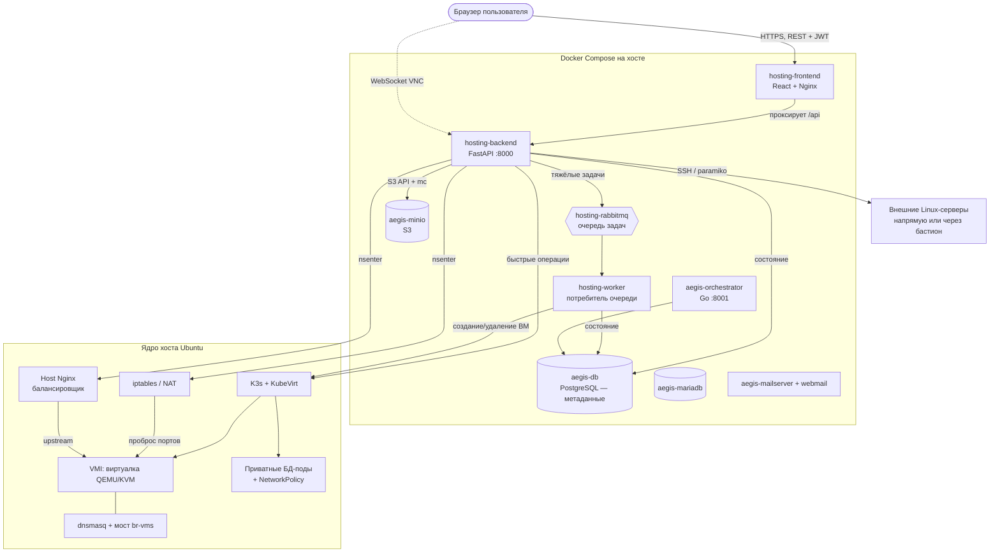

# Панель управления хостингом виртуальных машин ByteBurners Hosting

ByteBurners Hosting — это гиперконвергентная система хостинга виртуальных машин на базе Kubernetes и KubeVirt. Проект объединяет запуск полноценных виртуальных машин (QEMU/KVM), управление сетями через Multus CNI, сбор телеметрии с помощью Prometheus, асинхронную обработку задач через RabbitMQ и автоматическую балансировку входящего трафика с помощью хостового Nginx.

## Оглавление

1. [Архитектура системы](#архитектура-системы)
2. [Принципы работы платформы](#принципы-работы-платформы)
3. [Компоненты и кто с кем разговаривает](#компоненты-и-кто-с-кем-разговаривает)
4. [Ключевой приём: backend управляет хостом через nsenter](#ключевой-приём-backend-управляет-хостом-через-nsenter)
5. [Потоки запросов (жизненные циклы)](#потоки-запросов-жизненные-циклы)
6. [Где что хранится](#где-что-хранится)
7. [Карта кода](#карта-кода)
8. [Инструкции по установке](#инструкции-по-установке)
9. [Домены и автоматический HTTPS](#домены-и-автоматический-https)
10. [Развёртывание Windows Server и настройка RDP](#развёртывание-windows-server-и-настройка-rdp)
11. [Автозапуск, хранилище и квоты](#автозапуск-хранилище-и-квоты)
12. [Оптимизация хоста для HDD](#оптимизация-хоста-для-hdd)
13. [Обновление запущенной панели](#обновление-запущенной-панели)
14. [Проверка после установки или обновления](#проверка-после-установки-или-обновления)
15. [Модель безопасности](#модель-безопасности)
16. [Справочник портов и учётных записей](#справочник-портов-и-учётных-записей)
17. [Тесты бэкенда](#тесты-бэкенда)
18. [Мини-глоссарий](#мини-глоссарий)
19. [Журнал изменений](#журнал-изменений)

---

## Архитектура системы

Общая схема физического хоста — куда приходит трафик и как он попадает в виртуалку:


---

## Принципы работы платформы

1. **Вычислительные ресурсы (KubeVirt)**
   Виртуальные машины запускаются как стандартные поды Kubernetes с помощью оператора KubeVirt. Это дает изоляцию QEMU/KVM и при этом позволяет управлять жизненным циклом ВМ через декларативные манифесты Kubernetes.

2. **Асинхронные очереди и БД (PostgreSQL + RabbitMQ)**
   Все тяжелые операции (создание, ресайз, миграция, удаление ВМ) не блокируют бэкенд. FastAPI отправляет задачу в очередь **RabbitMQ**, после чего асинхронный воркер **Celery** выполняет команды взаимодействия с Kubernetes. Состояние виртуальных машин и настройки логируются в базе данных **PostgreSQL**.

3. **Сетевое окружение (Multus CNI & DHCP)**
   Для того чтобы виртуальные машины получали IP-адреса из выделенной подсети, на хосте настраивается мост `br-vms` (подсеть `172.20.0.0/24`). Multus CNI пробрасывает виртуальные интерфейсы подов напрямую в этот мост. Служба `dnsmasq` на хост-сервере автоматически раздает машинам IP-адреса по протоколу DHCP.

4. **Ограничение скорости дисков (iotune / QEMU limits)**
   В платформе реализовано ограничение пропускной способности дисков (IOPS и МБ/с) для каждой ВМ на уровне гипервизора QEMU. При создании ВМ бэкенд считывает лимиты из БД и прописывает параметры `disk_read_mbs`, `disk_write_mbs`, `disk_read_iops`, `disk_write_iops` непосредственно в конфигурацию диска манифеста `VirtualMachine`.

5. **Сбор телеметрии (Prometheus)**
   Бэкенд запрашивает метрики процессора, оперативной памяти и дисковой активности напрямую из Prometheus API. Для мгновенной работы опрос выполняется по ClusterIP сервиса Prometheus в сети Kubernetes. Исторические метрики отображаются в деталях каждой ВМ на фронтенде.

6. **Автоматический балансировщик (Nginx Upstream)**
   Панель управления позволяет создавать пулы балансировки в один клик. Бэкенд находит IP-адреса выбранных ВМ в Kubernetes, генерирует конфигурационный файл Nginx в `/etc/nginx/conf.d/` хоста (через пространство имен `/proc/1/root`) и выполняет перезапуск `nginx -s reload` на самом хосте.

7. **Проброс портов и Firewall (iptables)**
   Бэкенд динамически настраивает правила `iptables` в пространстве имен хоста, реализуя проброс входящих портов хоста (например, SSH 22068, HTTP 28068) на внутренние IP-адреса виртуальных машин.

8. **Свои домены и автоматический TLS (Caddy)**
   Приложения живут внутри ВМ за пробросом портов, а не как сервисы Kubernetes, поэтому вместо Ingress используется **Caddy** в контейнере с сетью хоста: он занимает порты 80/443 и одновременно видит IP виртуалок на мосту. Сертификаты Let's Encrypt Caddy выпускает и продлевает сам — по HTTP-01, если хост доступен извне, либо по DNS-01 через API Timeweb, если хост сидит за приватным IP (см. [«Домены и автоматический HTTPS»](#домены-и-автоматический-https)). Прежде чем клиентский домен попадёт в конфиг прокси, проверяются **две** DNS-записи: TXT `_aegis-challenge.<домен>` (подтверждение владения) и A-запись на IP сервера.

9. **Приватный реестр образов (Docker Registry v2)**
   Контейнер `registry:2` на хосте с обязательной аутентификацией (htpasswd/bcrypt). Пароль генерируется при первом запуске, хранится зашифрованным и показан администратору в панели. Панель обходит реестр по HTTP API v2 — список репозиториев, тегов и удаление образов по digest.

10. **Маркетплейс приложений**
    Каталог самодостаточных `docker-compose`-стеков (WordPress, Ghost, Nextcloud, n8n, Uptime Kuma, Vaultwarden, PostgreSQL, Redis). Установка в один клик поднимает выделенную ВМ, cloud-init пишет внутрь `docker-compose.yml` и `.env` и запускает стек. Секреты (пароли БД, admin-токены) генерируются автоматически и показываются один раз.

11. **Мониторинг и оповещения**
    Демон в воркере раз в минуту сверяет метрики (доступность ВМ, CPU и RAM машины или хоста) с правилами и шлёт уведомления в **Telegram** или на **webhook**. Сообщение отправляется только при смене состояния (норма ↔ сработал), поэтому повторов нет.

12. **Резервные копии по расписанию**
    Ежечасные, ежедневные или еженедельные бэкапы ВМ (клон диска через CDI DataVolume) и баз данных (дамп в MinIO) с политикой хранения: лишние копии ротируются автоматически.

13. **Проекты и роли (RBAC)**
    Ресурсы можно объединять в проекты и давать доступ коллегам по ролям: **наблюдатель** (только чтение), **редактор** (управление ресурсами), **владелец** (плюс управление участниками). Делятся все четыре типа ресурсов: **ВМ, базы данных, деплои и бакеты S3** — участник видит их в своих обычных вкладках («Базы данных», «S3 Хранилище») наравне со своими. Ресурсы без проекта остаются личными и ведут себя как раньше.

14. **Доступ по API: токены, CLI и Terraform**
    Персональные токены (`aeg_...`, в БД хранится только SHA-256) позволяют управлять хостингом из скриптов. В комплекте — CLI без зависимостей (`cli/aegis`) и **Terraform-провайдер** (`terraform-provider-aegis`) с ресурсами `aegis_vm` и `aegis_database`.

15. **Защита учётных записей (2FA)**
    Двухфакторная аутентификация по TOTP: подключение по QR-коду, одноразовые резервные коды, проверка кода при входе. Секрет хранится в БД зашифрованным.

---

## Компоненты и кто с кем разговаривает

Более детальная схема — на уровне контейнеров Docker Compose и того, что каждый из них умеет:



Кратко о ролях:

| Компонент | Что делает | С кем общается |
|---|---|---|
| **frontend** | React-панель, отдаётся через Nginx | Браузер → `/api` проксирует в backend |
| **backend (FastAPI)** | Вся логика, авторизация, API | K3s, RabbitMQ, PostgreSQL, MinIO, host nginx/iptables, внешние серверы |
| **worker** | Выполняет долгие задачи из очереди + фоновые демоны: расписания бэкапов, проверка правил алертов, лимиты дисков, переустановка проброса портов, вотчдог Caddy | RabbitMQ → K3s → PostgreSQL, Telegram/webhook |
| **RabbitMQ** | Очередь `vm_tasks` — развязывает API и тяжёлые операции | backend (пишет), worker (читает) |
| **PostgreSQL `aegis-db`** | Метаданные: пользователи, ВМ, БД, бакеты, диски, серверы | backend, worker, orchestrator |
| **MinIO** | S3-хранилище пользователей | backend (создаёт бакеты/ключи через `mc`) |
| **K3s + KubeVirt** | Запускает ВМ как поды, приватные БД-поды | backend, worker |
| **Host Nginx / iptables / dnsmasq** | Балансировка, проброс портов, DHCP для ВМ | backend через `nsenter` в неймспейс хоста |
| **`aegis-caddy`** | Реверс-прокси доменов панели/почты/хранилища и клиентских ВМ, сам выпускает и продлевает TLS Let's Encrypt (HTTP-01 или DNS-01) | backend/worker создают контейнер и кладут в него Caddyfile; наружу — 80/443 |
| **`aegis-registry`** | Приватный реестр Docker-образов с htpasswd-аутентификацией | backend (Registry API v2), клиенты `docker push/pull` |

Последние два контейнера панель создаёт **сама** через Docker-сокет — их нет в `docker-compose.yml`.

---

## Ключевой приём: backend управляет хостом через `nsenter`

Контейнер backend запущен как `privileged`, `network_mode: host`, `pid: host`.
Благодаря этому он через `nsenter --target 1` выполняет команды **в неймспейсе хоста** —
правит `iptables`, конфиги `/etc/nginx/conf.d`, перезагружает nginx. То есть «панель в контейнере»
реально настраивает сеть физического сервера.

> ⚠️ Обратная сторона: компрометация backend = root на хосте. Поэтому все места, куда
> подставляются пользовательские значения (IP файрвола, имена пулов), строго валидируются —
> см. [«Модель безопасности»](#модель-безопасности).

---

## Потоки запросов (жизненные циклы)

### Вход в панель
```
Браузер → POST /api/auth/login (логин+пароль)
  backend: verify_password (PBKDF2) → create_access_token (HMAC-подпись, ~JWT)
  ← access_token сохраняется в localStorage
Далее каждый запрос: main.jsx подставляет заголовок Authorization: Bearer <token>
  backend: get_current_user декодирует токен → находит пользователя
```
Защита от брутфорса: 5 неудач с одного IP за 5 минут → 429.

### Создание виртуальной машины (асинхронно)
```
Браузер → POST /api/vms  (get_current_user + проверка квот)
  backend: пишет строку VMTask (status=Pending) в PostgreSQL
  backend: publish_task("vm_tasks", {...}) → RabbitMQ        ← API сразу отвечает
  ─────────────────────────────────────────────
  worker: читает задачу → generate_linux/windows_manifest
  worker: k8s.create_vm_from_manifest → KubeVirt поднимает VMI
  worker: status=Running в PostgreSQL
Фронтенд каждые 5 сек опрашивает GET /api/vms и видит смену статуса.
```

### Как ВМ становится доступной снаружи (порты)
```
ВМ получает IP (KubeVirt masquerade / мост br-vms через dnsmasq)
backend вычисляет СТАБИЛЬНЫЙ внешний порт = 22000 + ID_ВМ  (не от IP!)
backend через nsenter добавляет DNAT:
   iptables PREROUTING --dport <ext_port> → <IP_ВМ>:22
Белый список firewall_rules превращается в правила FORWARD ACCEPT/DROP.
```
Порт берётся от ID из БД, поэтому **не меняется при перезагрузке** (см. `k8s_client.get_vm`).

### Подключение к своей БД («хаб подключения»)
```
Браузер → POST /api/databases (get_current_user + квота)
  backend: генерирует db_user/db_password (случайные)
  backend: k8s.create_private_db → под PostgreSQL/MySQL в K8s
  backend: NetworkPolicy запрещает весь вход, кроме привязанной ВМ
  db_password ШИФРУЕТСЯ (Fernet) и хранится в PostgreSQL
Кнопка «Подключиться» на фронте показывает host/port/user/pass и готовые
строки (psql / URI / Python / Node) — пароль расшифровывается на лету при отдаче.
```

### Внешний сервер через бастион (jump host)
```
Браузер → POST /api/external-servers (только админ)
  Если включён бастион: SSHInspector.open()
     paramiko: коннект к бастиону → канал direct-tcpip до целевого хоста
     → коннект к целевому серверу ЧЕРЕЗ этот канал (sock)
  Пароли сервера и бастиона ШИФРУЮТСЯ (Fernet) в PostgreSQL
Мониторинг, метрики и терминал сервера идут тем же путём (через бастион, если задан).
```

### Балансировщик
```
Браузер → POST /api/vms/balancer/pools (только админ, имя валидируется)
  backend: находит IP выбранных ВМ (валидирует как IPv4)
  backend: пишет /proc/1/root/etc/nginx/conf.d/aegis_balancer_<имя>.conf
  backend: nsenter → nginx -t && nginx -s reload
Трафик на публичный порт хоста распределяется nginx между ВМ.
```

### Свой домен с автоматическим TLS
```
Браузер → POST /api/domains  (цель: деплой или ВМ + внутренний порт)
  backend: генерирует токен и показывает ДВЕ записи, которые нужно создать:
     TXT  _aegis-challenge.<домен> = <токен>   ← доказательство владения
     A    <домен>                  = IP хоста  ← маршрутизация

Браузер → POST /api/domains/{id}/verify
  backend: сверяет TXT (dnspython) И A-запись (резолв в detect_host_ip)
  ТОЛЬКО если обе прошли:
     services/domains.build_entries → Caddyfile (upstream = IP_ВМ:порт)
     backend: put_archive кладёт конфиг в контейнер aegis-caddy
     backend: caddy reload  (без простоя)
  Caddy сам получает сертификат: по HTTP-01 на порту 80, если хост IP публичный,
  или по DNS-01 через API Timeweb, если хост IP приватный (is_private_host_ip).
```
TXT-проверка обязательна: без неё любой пользователь мог бы добавить домен,
который и так указывает на этот сервер, и увести его трафик на свою ВМ. Тот же
механизм DNS-01 применяется и к доменам самой панели, почты и консоли
хранилища — см. [«Домены и автоматический HTTPS»](#домены-и-автоматический-https).

### Установка приложения из маркетплейса
```
Браузер → POST /api/marketplace/deploy (app_id + размер ВМ)
  backend: resolve_env — секреты генерируются, переносы строк запрещены
  ФАЗА 1: создаётся запись ВМ → появляется её id
          внешний порт = 28000 + ID_ВМ  (известен только теперь)
  ФАЗА 2: PUBLIC_URL = http://<IP хоста>:<внешний порт>
          build_marketplace_cloud_init → docker-compose.yml + .env внутрь ВМ
  publish_task → worker создаёт ВМ
Внутри ВМ cloud-init ставит docker и выполняет `docker compose up -d`.
```
Две фазы нужны потому, что Ghost, WordPress, Nextcloud и n8n строят абсолютные
ссылки из своего URL, а он зависит от порта, который известен только после
появления ID виртуалки.

### Алерт и уведомление
```
worker (демон, раз в минуту) → services/alerts.evaluate_alerts
  для каждого включённого правила: читает метрику
     ВМ:   статус / CPU% / RAM%  (KubeVirt + metrics API)
     хост: CPU% / RAM%           (node metrics)
  is_breach(...) → новое состояние
  уведомление отправляется ТОЛЬКО при смене состояния (ok ↔ firing)
     webhook  → POST JSON (адрес заново проверяется на SSRF)
     telegram → api.telegram.org/bot<token>/sendMessage
```
Если метрика недоступна, состояние правила не меняется — чтобы временный сбой
сбора метрик не выглядел как авария.

---

## Где что хранится

| Данные | Где |
|---|---|
| Пользователи, квоты, метаданные ВМ/БД/бакетов/дисков/серверов | PostgreSQL `aegis-db` |
| **Секреты** (пароли внешних серверов, пароли БД, ключи S3, пароль бастиона) | PostgreSQL, **зашифрованы Fernet** (`app.core.crypto`) |
| Пароли пользователей панели | PostgreSQL, хэш PBKDF2-HMAC-SHA256 |
| Диски ВМ | K3s storage (local-path / OpenEBS LVM / NFS) |
| Файлы пользователей | MinIO (S3) |
| Конфиги балансировщика | `/etc/nginx/conf.d/` на хосте |
| Правила проброса | `iptables` хоста |
| Проекты, участники и роли | PostgreSQL: `projects`, `project_members`; `project_id` у ВМ/БД/деплоев/бакетов S3 |
| Свои домены (клиентские) и токены подтверждения | PostgreSQL `domains` |
| Домены служебных сервисов (`PANEL_DOMAIN`/`MAIL_DOMAIN`/`STORAGE_DOMAIN`/`RABBITMQ_DOMAIN`) и токен Timeweb | `.env` — не в БД, читаются напрямую из окружения |
| **TLS-сертификаты** | том `aegis-caddy-data` (Caddy хранит и продлевает их сам) |
| Образы приватного реестра | том `aegis-registry-data` |
| Пароль реестра | файл в `./data`, **зашифрован Fernet** |
| Расписания бэкапов и правила алертов | PostgreSQL: `backup_schedules`, `alert_rules` |
| Каналы уведомлений (bot_token, URL) | PostgreSQL `notification_channels`, **зашифрованы Fernet** |
| API-токены | PostgreSQL `api_tokens` — только SHA-256, сам токен не хранится |
| Секрет 2FA и резервные коды | PostgreSQL `users`: секрет зашифрован, коды — SHA-256 |
| Бэкапы ВМ / баз данных | CDI DataVolume в K3s / бакет `database-backups` в MinIO |

Ключ шифрования секретов — `AEGIS_SECRET_KEY` (если не задан, выводится из `ADMIN_TOKEN`).
**Менять его после первого запуска нельзя** — старые секреты не расшифруются.

---

## Карта кода

```
backend/app/
├── main.py                 # старт FastAPI, миграции, подключение роутеров, CORS
├── api/
│   ├── auth.py             # логин, пользователи, квоты, смена пароля, 2FA (TOTP)
│   ├── vms.py               # ВМ: создание, порты/файрвол, балансировщик, миграция
│   ├── databases.py        # управляемые БД + «хаб подключения»
│   ├── s3.py                # бакеты MinIO + файловый браузер
│   ├── external_servers.py # внешние серверы + БАСТИОН
│   ├── projects.py         # проекты, участники, привязка ресурсов (RBAC)
│   ├── domains.py          # свои домены, проверка владения, TLS через Caddy
│   ├── registry.py         # приватный реестр образов (admin)
│   ├── marketplace.py      # каталог и установка приложений в один клик
│   ├── alerts.py           # каналы уведомлений и правила оповещения
│   ├── backups.py          # расписания резервного копирования
│   ├── tokens.py           # персональные API-токены (aeg_...)
│   └── host.py, infra.py, clusters.py, volumes.py, mail.py, vnc.py, images.py
├── core/
│   ├── auth.py              # хэш паролей, токены, get_current_user / check_admin
│   ├── rbac.py               # РЕШЕНИЕ О ДОСТУПЕ (чистая has_permission + роли проекта)
│   ├── crypto.py             # ШИФРОВАНИЕ секретов (Fernet)
│   ├── ssrf.py                # проверка исходящих URL (webhook) по РЕЗУЛЬТАТУ резолва
│   ├── totp.py                # TOTP (RFC 6238), резервные коды, QR как SVG
│   ├── netutils.py           # detect_host_ip + ВАЛИДАТОРЫ (анти-инъекция)
│   ├── migrations.py         # идемпотентные ALTER TABLE
│   ├── schema_wait.py        # воркер ждёт, пока бэкенд создаст таблицы
│   └── k8s_client.py         # всё общение с KubeVirt / K8s
├── services/
│   ├── ssh_inspector.py      # SSH к внешним серверам + бастион
│   ├── domains.py            # генерация Caddyfile, TXT-челлендж, HTTP-01/DNS-01, жизненный цикл Caddy
│   ├── dns_api.py            # создание DNS-записей через API Timeweb/Cloudflare
│   ├── registry.py           # клиент Registry API v2 + провижининг с htpasswd
│   ├── marketplace.py        # каталог compose-стеков и сборка cloud-init
│   ├── alerts.py              # чтение метрик, стейт-машина правил, доставка
│   └── scheduled_backups.py  # расчёт next_run, запуск бэкапа, ротация
└── worker.py                 # потребитель очереди + демоны (бэкапы, алерты, файрвол, вотчдог Caddy,
                              # доперепроверка доменов); ждёт схему БД перед стартом демонов

frontend/src/
├── App.jsx                 # каркас, вход (в т.ч. код 2FA), сайдбар, создание ВМ
└── components/             # VMCard, VMDetail, DatabasesPanel, S3Panel, ProjectsPanel,
                            # DomainsPanel, RegistryPanel, MarketplacePanel,
                            # AlertsPanel, BackupsPanel, TokensPanel, ...

scripts/
├── add-domain.sh              # привязывает домены панели/почты/хранилища на УЖЕ УСТАНОВЛЕННОМ сервере
├── install-openebs-lvm.sh    # блочное хранилище LVM для hotplug-дисков (вызывается install.sh)
├── bootstrap-cluster-*.sh    # HA-кластер: SAN-СХД, master- и worker-нода
└── node-fencer.py             # автоматическая перезагрузка отвалившейся ноды HA-кластера

terraform-provider-aegis/   # Terraform-провайдер (Go): aegis_vm, aegis_database
cli/aegis                   # CLI без зависимостей (vm, db, schedule, token, audit)
```

---

## Инструкции по установке

Все варианты установки требуют включенную **аппаратную виртуализацию**. Убедитесь, что вывод команды `egrep -c '(vmx|svm)' /proc/cpuinfo` больше 0, и установлен пакет проверки:
```bash
sudo apt-get install -y cpu-checker
kvm-ok
# Вывод должен быть: "INFO: /dev/kvm exists / KVM acceleration can be used"
```

### Вариант 1. Установка на обычный выделенный сервер (Bare Metal или виртуалка)
Это основной путь установки — один скрипт ставит K3s, KubeVirt, Multus, сетевой мост,
Prometheus, LVM-хранилище, спрашивает пароли и сразу поднимает панель.

1. Установите чистую **Ubuntu 22.04 LTS / 24.04 LTS**.
2. Склонируйте репозиторий и запустите установщик от имени root:
   ```bash
   git clone https://github.com/Monopoly450/Hosting.git ~/Hosting
   cd ~/Hosting
   chmod +x install.sh
   sudo ./install.sh
   ```
   В самом начале, сразу после установки пакетов, откроется текстовый мастер
   в рамках (как в raspi-config) и спросит пароли для базы данных, очереди,
   MinIO и токен администратора — на каждый пункт можно просто нажать OK не
   вводя ничего, тогда подставится надёжное случайное значение. Следом мастер
   спросит про домены для панели/почты/хранилища и API-токен Timeweb Cloud —
   тоже необязательно, Enter пропускает (см. [«Домены и автоматический
   HTTPS»](#домены-и-автоматический-https)). После этого можно уходить: 10-15
   минут установки K3s/KubeVirt идут без вопросов. В конце будет напечатан
   адрес панели и пароль входа.

   Для автоматической установки без вопросов (например, в скрипте разворачивания)
   используйте флаг `--yes`: пароли сгенерируются сами, их можно посмотреть в `.env`.
   ```bash
   sudo ./install.sh --yes
   ```
   > [!TIP]
   > **Проблема с зависанием загрузки K3s с GitHub:**
   > Если скачивание K3s зависает из-за сетевых блокировок, скачайте бинарник на локальный ПК и перекиньте на сервер:
   > 1. На вашем Mac/ПК: `curl -LO https://github.com/k3s-io/k3s/releases/download/v1.36.2+k3s1/k3s && scp k3s root@IP_СЕРВЕРА:/tmp/k3s`
   > 2. На сервере: `mv /tmp/k3s /usr/local/bin/k3s && chmod +x /usr/local/bin/k3s`
   > 3. Запуск на сервере: `INSTALL_K3S_SKIP_DOWNLOAD=true ./install.sh`

   Скрипт безопасно перезапускать: уже выполненные шаги (K3s, KubeVirt и т.п.)
   пропускаются, а к существующему `.env` он не притронется без явного согласия.

---

### Вариант 2. Установка в виртуальной среде Windows Hyper-V
Для развертывания Ubuntu внутри Hyper-V с запуском KubeVirt виртуальных машин внутри нее требуется активировать Nested Virtualization (вложенную виртуализацию) и разрешить спуфинг MAC-адресов на виртуальном сетевом адаптере, иначе внутренняя сеть ВМ будет блокироваться Hyper-V. Это делается на стороне Windows-хоста, `install.sh` внутри гостевой Ubuntu этого не увидит.

1. Создайте виртуальную машину в Hyper-V (например, с именем `Ubuntu-Aegis`) и установите Ubuntu Server.
2. Выключите созданную ВМ.
3. Откройте **PowerShell от имени администратора** на вашем хост-компьютере с Windows и выполните команды:
   ```powershell
   # 1. Включение вложенной виртуализации
   Set-VMProcessor -VMName "Ubuntu-Aegis" -ExposeVirtualizationExtensions $true

   # 2. Разрешение MAC Address Spoofing (чтобы работали виртуальные сетевые карты внутри моста br-vms)
   Set-VMNetworkAdapter -VMName "Ubuntu-Aegis" -MacAddressSpoofing On
   ```
   *(Также разрешить спуфинг MAC-адресов можно через GUI Hyper-V: Параметры ВМ -> Сетевой адаптер -> Дополнительные компоненты -> Включить спуфинг MAC-адресов).*
4. Запустите ВМ в Hyper-V, зайдите по SSH и проверьте доступность KVM:
   ```bash
   kvm-ok
   ```
5. Дальше — как в Варианте 1:
   ```bash
   git clone https://github.com/Monopoly450/Hosting.git ~/Hosting
   cd ~/Hosting
   chmod +x install.sh
   sudo ./install.sh
   ```

---

### Вариант 3. Настройка сервера с публичным ("белым") IP-адресом
Если ваш хост-сервер имеет выделенный публичный статический IP-адрес для внешнего доступа к ВМ — тот же `install.sh`, что и в Варианте 1.

1. Установите систему и запустите установщик:
   ```bash
   chmod +x install.sh
   sudo ./install.sh
   ```
   Скрипт автоматически определит ваш основной внешний сетевой интерфейс (на котором висит белый IP) и настроит правила NAT Masquerade через `iptables`. Когда мастер спросит про внешний адрес — если определённый автоматически адрес совпадает с белым IP, просто нажмите Enter; если сервер за NAT и белый адрес отличается, введите его явно (это ляжет в `AEGIS_HOST_IP`).
2. После создания виртуальной машины в панели:
   * **Для ручного проброса портов**: укажите порты во вкладке настроек ВМ. Система автоматически пробросит порт с вашего белого IP на внутренний IP ВМ.
   * **Для балансировки**: Создайте Балансировочный пул, укажите публичный порт (например, `8090`) и выберите ваши ВМ. Трафик, поступающий на ваш белый IP `http://<белый_IP>:8090`, будет автоматически распределяться между вашими ВМ.

### Вариант 4. Настройка отказоустойчивого 3-нодового кластера (HA Cluster)
Режим высокой доступности объединяет несколько вычислительных нод и общую сетевую СХД. Это позволяет выполнять Живую миграцию (Live Migration) без отключения виртуальных машин и обеспечивает автоматическое восстановление (failover) при выходе из строя одного из физических серверов.

Для развертывания требуются три сервера:
1. **`san-storage`** — выделенная сетевая СХД (NFS-сервер).
2. **`node-1`** — Master-нода Kubernetes (на ней же запускается панель управления Aegis).
3. **`node-2`** — Worker-нода Kubernetes (дополнительный вычислительный узел).

#### Шаг 1. Настройка СХД (`san-storage`)
1. Склонируйте репозиторий на сервер СХД:
   ```bash
   git clone https://github.com/Monopoly450/Hosting.git ~/Hosting
   cd ~/Hosting
   ```
2. Запустите скрипт настройки сетевой шары (он автоматически создаст LVM-диск vg0, смонтирует NFS и раздаст права):
   ```bash
   sudo ./scripts/bootstrap-cluster-storage.sh
   ```

#### Шаг 2. Настройка Master-ноды (`node-1`)
1. Склонируйте репозиторий на `node-1`:
   ```bash
   git clone https://github.com/Monopoly450/Hosting.git ~/Hosting
   cd ~/Hosting
   ```
2. Запустите скрипт настройки мастера. Скрипт установит K3s, Multus, KubeVirt, настроит Helm и автоматически установит службу авто-перезагрузки (Aegis Node Fencer):
   ```bash
   sudo ./scripts/bootstrap-cluster-node1.sh
   ```
   *При запросе введите IP-адрес сервера `san-storage`.*
3. В конце выполнения скрипта скопируйте сгенерированный **K3S Join Token**.
4. Создайте файл конфигурации окружения `.env` и укажите в нем использование сетевого класса хранения:
   ```bash
   cp .env.example .env
   ```
   Откройте `.env` и отредактируйте переменную:
   ```env
   STORAGE_CLASS=nfs-storage
   ```
5. Запустите панель управления:
   ```bash
   docker compose up -d --build
   ```

#### Шаг 3. Настройка Worker-ноды (`node-2`)
1. Запустите скрипт на `node-2` для автоматического присоединения ноды к кластеру:
   ```bash
   git clone https://github.com/Monopoly450/Hosting.git ~/Hosting
   cd ~/Hosting
   sudo ./scripts/bootstrap-cluster-node2.sh
   ```
   *При запросе введите IP-адрес `node-1` и K3S Join Token, полученный на Шаге 2.*

#### Шаг 4. Установка NFS-клиента на нодах
Для того чтобы K3s мог монтировать диски с СХД, на **всех** вычислительных серверах должен быть установлен пакет `nfs-common` (скрипты настройки нод 1 и 2 устанавливают его автоматически). Убедиться в его наличии можно командой:
```bash
sudo apt update && sudo apt install -y nfs-common
```

---

## Домены и автоматический HTTPS

Кроме доменов клиентских ВМ (раздел «Домены» в панели), собственные домены можно
привязать и к служебным сервисам этого хоста — панели управления, вебмейлу
(Roundcube), консоли объектного хранилища (MinIO) и консоли очереди (RabbitMQ).
В обоих случаях это делает один и тот же Caddy-контейнер (`aegis-caddy`), а домен
открывается без порта в адресе: `https://ваш-домен` вместо `https://IP:8443`.

### Обычный случай: у сервера публичный IP

Caddy получает сертификат Let's Encrypt через **HTTP-01** — сам отвечает на проверку
по порту 80. Ничего специально настраивать не нужно: добавьте A-запись на IP сервера,
и — для клиентских доменов — привяжите домен через раздел «Домены» в панели.

### Сервер за приватным IP (домашняя/локальная сеть, нет «белого» адреса)

HTTP-01 в этом случае в принципе не работает: Let's Encrypt должен достучаться до
порта 80 **извне**, а приватный адрес снаружи не виден. Вместо этого используется
**DNS-01** — Caddy подтверждает владение доменом, создавая TXT-запись через API
DNS-провайдера, и подключение к серверу снаружи не требуется вовсе. Поддержаны
два провайдера: **Timeweb Cloud** и **Cloudflare** (модули `caddy-dns/timeweb` и
`caddy-dns/cloudflare`; образ Caddy собирается локально через `xcaddy` — готового
с этими плагинами не существует, см. `aegis-caddy/Dockerfile`).

Нужен API-токен того провайдера, у которого обслуживается зона — достаточно
одного (`TIMEWEB_DNS_API_TOKEN` или `CLOUDFLARE_DNS_API_TOKEN`); если заданы оба,
используется Cloudflare. DNS-01 автоматически включается для **любого** домена
(панель, почта, хранилище, клиентские ВМ), если хост определён как приватный
(`is_private_host_ip`) и токен задан — руками переключать ничего не нужно.

### Домен подключается сам

С этим же токеном панель **создаёт DNS-записи за вас**. Во вкладке «Домены и TLS»
достаточно ввести домен и выбрать, куда он ведёт:

1. панель создаёт в вашей зоне TXT-запись подтверждения владения и A-запись на
   этот сервер (`app/services/dns_api.py`);
2. фоновая проверка в воркере раз в минуту ждёт, пока записи разойдутся по
   публичным резолверам (`autoverify_tick`), и включает домен в конфиг Caddy;
3. Caddy выпускает сертификат.

Ходить к регистратору и жать «Проверить» вручную не нужно — страница обновляется
сама. Владение доменом при этом не «пропускается»: наличие API-токена зоны и есть
доказательство владения, причём более сильное, чем TXT-запись, которую этим же
токеном и создают. Без токена всё работает как раньше — панель показывает обе
записи для ручного создания.

### Как привязать домены

**При установке** — `install.sh` сам спрашивает домены для панели/почты/хранилища/
очереди, провайдера DNS и его токен, а также токен Cloudflare Tunnel (весь блок
можно пропустить, Enter на каждом вопросе — тогда всё как обычно доступно по IP
и портам).

**На уже установленном сервере** — `scripts/add-domain.sh`:
```bash
sudo bash scripts/add-domain.sh
```
Спросит домены (каждый — по желанию) и токен, сам обновит `.env`, перезапустит
`backend`/`worker` и применит конфиг Caddy без пересоздания контейнера
(`POST /api/domains/reapply`, авторизация `X-Admin-Token`). В отличие от
повторного запуска `install.sh` на уже работающем сервере (который либо
перегенерирует все пароли и рискует сломать уже инициализированную БД, либо
вообще пропускает вопрос про домен, если ответить «оставить `.env` как есть»),
этот скрипт трогает только строки доменов и токенов:
`PANEL_DOMAIN` / `MAIL_DOMAIN` / `STORAGE_DOMAIN` / `RABBITMQ_DOMAIN` /
`TIMEWEB_DNS_API_TOKEN` / `CLOUDFLARE_DNS_API_TOKEN` /
`CLOUDFLARE_TUNNEL_TOKEN` / `COMPOSE_PROFILES`.

**Вручную** — впишите в `.env` те же переменные и перезапустите:
```bash
docker compose up -d --build backend worker
```

### Переменные `.env`

```bash
# PANEL_DOMAIN=home.example.com
# MAIL_DOMAIN=mail.example.com
# STORAGE_DOMAIN=storage.example.com
# RABBITMQ_DOMAIN=queue.example.com
# TIMEWEB_DNS_API_TOKEN=          # если зона у Timeweb Cloud
# CLOUDFLARE_DNS_API_TOKEN=       # если зона у Cloudflare
```
Все необязательны и независимы друг от друга — можно задать только один домен,
только токен без доменов ни на что не влияет. Токенов провайдера достаточно
одного.

Домена для PostgreSQL и MariaDB здесь нет намеренно: Caddy — реверс-прокси для
HTTP, а СУБД говорят по своему бинарному протоколу поверх TCP, и «домен» им
ничего не даёт. Подключаются к ним по адресу и порту — реквизиты показывает
хаб подключения на вкладке «Базы данных».

## Доступ из интернета без «белого» IP: Cloudflare Tunnel

DNS-01 решает задачу сертификата, но не задачу доступности: если у сервера
приватный адрес, домен ведёт в локальную сеть и снаружи сайт всё равно не
открывается. Сертификат при этом выпускается честный — просто пользоваться им
может только тот, кто уже внутри сети.

**Cloudflare Tunnel** заходит с другой стороны: контейнер `cloudflared`
устанавливает исходящее соединение к Cloudflare, и Cloudflare принимает запросы
к домену на себя. Открывать порты на роутере или получать «белый» IP не нужно
вовсе — входящих соединений к серверу не происходит.

**Что нужно сделать в Cloudflare** (один раз):

1. Zero Trust → Networks → Tunnels → Create a tunnel → Cloudflared.
2. Выбрать способ установки **Docker** — в показанной команде нужна длинная
   строка после `--token`. Это и есть токен туннеля.
3. На вкладке **Public hostnames** добавить домены и указать, куда они ведут
   внутри сервера:

   | Публичный домен | Service |
   |---|---|
   | `home.example.com` | `http://localhost:8081` — панель |
   | `mail.example.com` | `http://localhost:8082` — вебмейл |
   | `storage.example.com` | `http://localhost:9001` — консоль MinIO |
   | `queue.example.com` | `http://localhost:15672` — консоль RabbitMQ |

   DNS-записи для этих имён Cloudflare создаёт сам.

**Что нужно сделать на сервере:**

```bash
sudo bash scripts/add-domain.sh
```
Скрипт спросит токен туннеля, впишет в `.env` `CLOUDFLARE_TUNNEL_TOKEN` и
`COMPOSE_PROFILES=cloudflare` и поднимет контейнер. То же самое спрашивает
`install.sh` при первой установке.

`COMPOSE_PROFILES` обязателен: сервис `cloudflared` в `docker-compose.yml`
объявлен с `profiles: ["cloudflare"]`, и без активного профиля `docker compose
up` его не трогает. Сделано намеренно — иначе на каждой установке без туннеля
контейнер запускался бы с пустым токеном и уходил в бесконечный рестарт.

Проверить:
```bash
docker compose logs cloudflared --tail 30
```
В логе должно быть `Registered tunnel connection`. Сертификат для публичного
имени в этом случае выдаёт Cloudflare — Caddy при этом продолжает обслуживать
те же сервисы внутри сети по своим доменам, одно другому не мешает.

### Диагностика

Сертификат обычно выпускается за 1-2 минуты после применения конфига. Если
дольше:
```bash
docker logs aegis-caddy --tail 100 | grep -E "certificate obtained|challenge failed|will retry"
```
Типичная причина задержки — медленное распространение DNS-записи у провайдера
(TXT-запись видна одним публичным резолверам и ещё не видна другим). Caddy сам
повторяет попытки с растущим интервалом (60с → 120с → …) — обычно достаточно
подождать несколько минут, **не пересоздавая контейнер** (пересоздание сбрасывает
попытку на новый токен challenge и обнуляет накопленный интервал ретраев).

**`NXDOMAIN looking up TXT for _acme-challenge.<домен>`.** Caddy создал
TXT-запись через API провайдера, но Let's Encrypt спросил её раньше, чем NS
успели отдать. Не путайте эту запись с `_aegis-challenge.<домен>` — та
подтверждает владение доменом для самой панели, живёт отдельно, и её наличие
о сертификате ничего не говорит: панель может показывать «DNS подтверждён»,
пока сертификата ещё нет.

Задержка перед первой проверкой — `propagation_delay` в Caddyfile, сейчас 2
минуты (`ACME_PROPAGATION_DELAY` в `services/domains.py`). Раньше стояло 30
секунд, и NS Timeweb в них не укладывались: один домен получал NXDOMAIN три
попытки подряд, соседний успевал за 36 секунд — то есть впритык.

`acme-staging-v02.api.letsencrypt.org` в логе появляться больше не должен.
certmagic держит отдельный тестовый CA и после неудачи уходит проверять
настройку на него, чтобы не жечь лимиты боевого; на практике это только
мешает — staging и боевой выпуск идут по одному имени `_acme-challenge` и
затирают токены друг друга, а пока длится крюк, у домена нет годного
сертификата и браузер пишет «не удалось установить защищённое соединение».
Поэтому `test_dir` в конфиге указывает на тот же боевой каталог: переключаться
некуда. Одного явного `issuer acme` для этого недостаточно — проверено на
живом сервере.

Если staging-сертификат уже успел залипнуть, его нужно убрать разово:
```bash
docker exec aegis-caddy rm -rf /data/caddy/certificates/acme-staging-v02.api.letsencrypt.org-directory/<домен>
docker restart aegis-caddy
```
Проверить, какие боевые сертификаты выпущены:
```bash
docker exec aegis-caddy ls /data/caddy/certificates/acme-v02.api.letsencrypt.org-directory/
```

**`relation "domains" does not exist` в логах воркера.** Так выглядела гонка при
старте: docker compose поднимает воркер сразу после healthcheck'а PostgreSQL, а
таблицы создаёт бэкенд на своём старте — воркер успевал раньше и все его демоны
уходили в цикл ошибок, из-за чего прокси доменов не поднимался вовсе. Воркер
теперь ждёт схему (`core/schema_wait.py`), а `install.sh` не рапортует «готово»,
пока бэкенд не ответит. На уже установленном сервере достаточно обновиться и
перезапустить:
```bash
docker compose up -d --build backend worker
```

---

## Развёртывание Windows Server и настройка RDP

В платформу Aegis добавлена возможность автоматического развертывания **Windows Server 2022**.

### 1. Создание и установка ВМ
1. При создании виртуальной машины выберите **Windows Server** в качестве ОС.
2. После запуска откройте консоль **VNC** в панели Aegis.
3. Пройдите шаги установщика Windows. Когда программа спросит, куда устанавливать ОС, диск будет пуст. Нажмите **«Load Driver» -> «Browse»** (Загрузить драйвер -> Обзор).
4. Зайдите на CD-диск `virtio-win-...` (обычно диск `E:`), прокрутите вниз, найдите папку **`viostor`** -> папка **`2k22`** -> папка **`amd64`**. Нажмите **OK** и продолжите установку.

### 2. Установка драйверов и агента (внутри запущенной Windows)
1. Зайдите на рабочий стол Windows под пользователем `Administrator`.
2. Откройте проводник, перейдите на CD-диск `E:` (`virtio-win-...`) и запустите общий установщик:
   * **`virtio-win-gt-x64.msi`** (или `virtio-win_amd64.msi`).
3. Пройдите установку (кнопки Next -> Install). Это автоматически поднимет сеть (сетевая карта `NetKVM`), установит видеодрайвер для плавной графики и настроит Guest Agent для графиков в панели.

### 3. Включение удаленного доступа (RDP) и подключение
1. В Windows откройте Поиск -> введите **«Remote Desktop settings»** -> включите переключатель **Enable Remote Desktop** в положение **On**.
2. В веб-панели Aegis в деталях вашей ВМ скопируйте строку подключения. Система сама рассчитает и пробросит внешний RDP-порт по формуле `33000 + последний октет IP ВМ`.
3. На Mac откройте **Royal TSX**, установите бесплатный плагин **Remote Desktop (FreeRDP)** через Preferences -> Plugins, создайте подключение, указав IP сервера, проброшенный порт, логин `Administrator` и сгенерированный пароль.

---

## Автозапуск, хранилище и квоты

`install.sh` уже настраивает автозапуск и хранилище сам — ничего отдельно запускать не нужно. Ниже — что именно он сделал, на случай диагностики.

### Автозапуск служб (systemd)
Для автоматического поднятия виртуальной сети `br-vms`, настройки IPTables NAT и запуска контейнеров панели управления при загрузке ОС хоста, `install.sh` регистрирует две системные службы:
*   `aegis-network.service` — запускается до старта Docker/K3s, создаёт мост `br-vms`, включает маршрутизацию трафика (`ip_forward`) и восстанавливает правила NAT Masquerade.
*   `aegis-hosting.service` — отвечает за автоматический старт и корректное выключение всех Docker Compose контейнеров панели в папке проекта.

Проверка статуса автозапуска:
```bash
sudo systemctl status aegis-network.service
sudo systemctl status aegis-hosting.service
```

### Блочное хранилище LVM (OpenEBS LVM)
Для поддержки **горячей замены дисков (hotplug)** виртуальных машин «на лету» без их остановки, используется OpenEBS LVM LocalPV драйвер — `install.sh` настраивает его автоматически (вызывает `scripts/install-openebs-lvm.sh`). Если после установки диска видите статус `Pending`, а `kubectl describe pvc` — ошибку `exit status 5` (зависшие loop-устройства), перезапустите настройку хранилища вручную:
```bash
sudo bash scripts/install-openebs-lvm.sh
```
Если и это не помогло — проверьте **только** loop-устройство Aegis.
`losetup -D` здесь использовать нельзя: он отключает все loop-устройства
хоста, включая не принадлежащие панели. Не перезапускайте loop-службу при
существующих PVC/запущенных ВМ: сначала используйте безопасную процедуру сброса.
```bash
sudo losetup -j /var/lib/aegis/lvm-storage.img
sudo systemctl status aegis-lvm-loop.service
```

Полное необратимое удаление и корректная переустановка хранилища описаны в
[docs/LVM_RESET.md](docs/LVM_RESET.md).

**Что делает скрипт:**
1.  Создаёт разреженный (sparse) файл-образ `/var/lib/aegis/lvm-storage.img`. При запуске через `install.sh` размер по умолчанию равен 60% свободного места; при ручном запуске запасное значение — 40 ГБ.
2.  Настраивает systemd-службу `aegis-lvm-loop.service` для автоматического монтирования этого файла как петлевого loop-устройства при загрузке, с `--direct-io=on` — это обходит двойное кэширование на хосте, снижая нагрузку на CPU.
3.  Инициализирует `vg-aegis`, создаёт thin-тома OpenEBS, включает мониторинг/авторасширение thin-pool и настраивает класс снимков.

### Контроль физических ресурсов и квот хоста
При создании виртуальных машин бэкенд платформы выполняет жесткую валидацию ресурсов, гарантируя стабильность работы:
*   **Валидация физических возможностей**: Вы не сможете создать ВМ, ресурсы которой (CPU, RAM, диск) превышают физические возможности самого сервера (количество физических ядер `os.cpu_count()`, общую оперативную память и свободное место на диске).
*   **Учёт резервации**: Система рассчитывает суммарные ресурсы всех запущенных виртуальных машин и не позволяет создавать новые инстансы, если свободный нераспределенный лимит хоста исчерпан.
*   **Квоты студентов**: Студенты больше не привязаны к балансу. Вместо этого в панели администратора каждому пользователю задаются персональные квоты (лимиты CPU, RAM, диска, баз данных и S3 бакетов). При создании ресурсов система проверяет остаток квот пользователя.

### Управление пользователями в панели администратора
Администратор имеет полный контроль над учетными записями:
*   **Редактирование лимитов**: Изменение квот CPU, RAM и дисков для любого пользователя в реальном времени.
*   **Сброс паролей**: Возможность принудительного изменения пароля пользователя администратором.
*   **Самообслуживание**: Любой авторизованный пользователь может самостоятельно сменить свой пароль через виджет в сайдбаре панели.

---

## Оптимизация хоста для HDD

Чтобы механический жесткий диск на хост-сервере работал максимально отзывчиво и **не вызывал полных зависаний ядра Linux** во время импорта тяжелых ВМ (например, Windows Server 2022 на 100 ГБ), стоит ограничить размер грязного дискового кэша в оперативной памяти и переключить планировщик. `install.sh` уже применяет пункт 1 сам; пункты 2-3 — для ручной донастройки.

### 1. sysctl против I/O Lockup (зависаний)
Ядро Linux сбрасывает данные на диск гораздо раньше и мелкими порциями, исключая эффект "захлебывания" HDD:
```bash
# Применить временно (до перезагрузки):
sudo sysctl -w vm.dirty_background_ratio=5
sudo sysctl -w vm.dirty_ratio=10

# Сохранить навсегда:
echo "vm.dirty_background_ratio=5" | sudo tee -a /etc/sysctl.d/99-aegis-hdd-tuning.conf
echo "vm.dirty_ratio=10" | sudo tee -a /etc/sysctl.d/99-aegis-hdd-tuning.conf
sudo sysctl --system
```

### 2. Direct I/O для LVM-хранилища
`scripts/install-openebs-lvm.sh` уже добавляет `--direct-io=on` в службу монтирования loop-устройства — обходит двойное кэширование на хосте. При повторном запуске скрипта служба пересоздастся с этой настройкой:
```bash
sudo bash ./scripts/install-openebs-lvm.sh
```

### 3. Планировщик диска BFQ
Выполните на хост-сервере (где `sda` — имя вашего физического жесткого диска):
```bash
sudo sh -c 'echo bfq > /sys/block/sda/queue/scheduler'
```
Предотвращает "подвисание" хоста во время активной записи данных виртуальными машинами.

---

## Обновление запущенной панели

Когда в репозитории появились изменения, на сервере достаточно:
```bash
cd ~/Hosting
git pull --ff-only origin main
docker compose up -d --build
```
`--build` обязателен, если менялся код бэкенда/фронтенда — иначе Docker переиспользует старый образ. Миграции БД бэкенд применяет сам при старте, вручную запускать не нужно.

Пересобрать можно и один сервис, если менялся только он (например, только фронтенд):
```bash
docker compose up -d --build frontend
```

Если поменялся только `.env` (например, добавили домен вручную, без `scripts/add-domain.sh`) — пересборка не нужна, достаточно пересоздать контейнеры нужных сервисов:
```bash
docker compose up -d backend worker
```

---

## Проверка после установки или обновления

Юнит-тесты проверяют логику, но не доказывают, что контейнер поднимется, образ
скачается, а сертификат выпустится на реальном сервере. Ниже — минимальный
проход, который ловит именно такие сбои. Все команды выполняются **на
хост-сервере**, из каталога проекта.

### 1. Контейнеры и базовая доступность
```bash
docker compose ps          # все сервисы healthy / running
docker compose logs backend --tail=50 | grep -iE "error|traceback" || echo "ошибок при старте нет"
curl -s localhost:8000/ | head -c 200        # {"status":"online",...}
```
- [ ] Панель открывается, вход работает

Обязательные переменные — без них compose откажется стартовать и сам назовёт недостающую:
```bash
for v in POSTGRES_PASSWORD RABBITMQ_USER RABBITMQ_PASS RABBITMQ_URL \
         MINIO_ROOT_PASSWORD MARIADB_ROOT_PASSWORD ADMIN_TOKEN \
         DB_CONN_STR DATABASE_URL AEGIS_SECRET_KEY; do
  grep -q "^$v=" .env || echo "НЕ ХВАТАЕТ: $v"
done
```

### 2. Определение внешнего IP
Фундамент сразу для трёх функций (маркетплейс, реестр, домены):
```bash
docker compose exec backend python -c \
  "from app.core.netutils import detect_host_ip; print(detect_host_ip())"
```
- [ ] Возвращается реальный адрес сервера, **не** `127.0.0.1`. Если сервер за NAT и адрес неверный — задайте `AEGIS_HOST_IP` в `.env` и перезапустите.

### 3. Служебные порты закрыты снаружи
С рабочей машины (не с сервера):
```bash
nc -vz <IP_СЕРВЕРА> 5432   # ожидается "Connection refused" / timeout
```
- [ ] PostgreSQL/RabbitMQ/MariaDB/консоль MinIO недоступны снаружи

### 4. Секреты зашифрованы
```bash
docker compose logs backend | grep -i "секрет"   # при наличии старых открытых секретов — строка про дошифровку
docker compose exec db psql -U postgres -d aegis -c "SELECT left(password,10) FROM external_servers LIMIT 1;"
```
- [ ] Пароли в БД имеют префикс `enc:v1:` (или таблица пуста, если серверов ещё нет)

### 5. Реестр образов
Вкладка **«Контейнерный реестр»** → «Запустить реестр».
```bash
docker ps --filter name=aegis-registry
HOST=<IP сервера>:5000
# Реестр работает по HTTP — добавьте в insecure-registries:
#   /etc/docker/daemon.json → {"insecure-registries": ["<IP сервера>:5000"]}
#   sudo systemctl restart docker
docker login $HOST -u aegis            # пароль — со вкладки реестра
docker pull alpine:latest && docker tag alpine:latest $HOST/test-image:v1 && docker push $HOST/test-image:v1
docker logout $HOST
curl -s -o /dev/null -w "%{http_code}\n" http://$HOST/v2/_catalog   # ожидается 401
```
- [ ] Push работает после `docker login`
- [ ] Без авторизации — 401

### 6. Маркетплейс приложений
Установите **Uptime Kuma** (самое лёгкое приложение) и следите за созданием ВМ:
```bash
docker compose logs worker -f --tail=30
```
Через 1-3 минуты, когда статус станет `Running`, зайдите по SSH и проверьте, что внутри реально поднялся стек:
```bash
ssh ubuntu@<IP сервера> -p <SSH-порт из панели>
  sudo cloud-init status --long                        # done, без ошибок
  sudo docker compose -f /opt/app/docker-compose.yml ps  # контейнеры Up
```
- [ ] ВМ создалась, cloud-init отработал без ошибок
- [ ] Приложение открывается по ссылке из панели
- [ ] У Ghost/WordPress ссылки ведут на реальный адрес, а не на localhost

### 7. Домены и TLS
См. [«Домены и автоматический HTTPS»](#домены-и-автоматический-https) для деталей DNS-01/HTTP-01. Кратко:
```bash
docker ps --filter name=aegis-caddy
docker logs aegis-caddy --tail=50 | grep -iE "certificate|error"
curl -sI https://<домен> | head -3       # HTTP/2 200
```
- [ ] TXT-проверка владения проходит
- [ ] Сертификат выпущен, сайт открывается по HTTPS
- [ ] Без TXT-записи домен **не** попадает в проксирование

### 8. Бэкапы по расписанию
Создайте расписание для ВМ и нажмите «Запустить сейчас»:
```bash
kubectl get datavolumes | grep backup
docker compose logs worker --tail=30 | grep -i backup
docker compose exec minio mc ls local/database-backups/ 2>/dev/null || echo "проверьте через веб-консоль MinIO"
```
- [ ] Ручной запуск создаёт копию, поле «последний запуск» обновилось
- [ ] Ротация: при retention=1 старые копии удаляются

### 9. Алерты
Создайте канал (удобно проверять через `webhook.site`) и нажмите «Тест», затем создайте правило «ВМ упала» и выключите тестовую ВМ (`virtctl stop <имя>`).
- [ ] Тестовое уведомление доходит
- [ ] Алерт срабатывает в течение минуты и восстанавливается при запуске ВМ (без повторов)
- [ ] Webhook на `http://169.254.169.254/...` или `http://localhost:8000/...` отклоняется (защита от SSRF)

### 10. Проекты и роли (RBAC)
Создайте второго пользователя, проект, добавьте его **наблюдателем**, привяжите к проекту ВМ и бакет S3, войдите под вторым пользователем:
- [ ] Чужая ВМ видна в списке, детали открываются
- [ ] Кнопки удаления/перезапуска дают **403** (наблюдатель не меняет ресурсы)
- [ ] Общий бакет виден во вкладке «S3 Хранилище», файлы открываются и скачиваются
- [ ] Загрузка и удаление файлов в нём дают **403** — до смены роли на «редактор»
- [ ] После смены роли на «редактор» управление появляется

### 11. Двухфакторная аутентификация
Меню аккаунта → «Двухфакторная защита» → «Настроить 2FA».
- [ ] QR-код сканируется, код подтверждается, показываются резервные коды
- [ ] Вход требует код после пароля; резервный код срабатывает один раз
- [ ] Отключение 2FA требует подтверждения кодом

### 12. LVM-хранилище
```bash
docker compose exec backend pvdisplay   # физический том /dev/loop0 или аналогичный
```

### Что делать при сбое
Ответы `5xx` отдают только код обращения — полный текст ищется в логах по этому коду:
```bash
docker compose logs backend --tail=100
docker compose logs worker --tail=100
docker compose logs backend | grep <код из сообщения>
```

---

## Модель безопасности

- **Авторизация**: токен в заголовке `Authorization` (не в куках). Все API требуют
  `get_current_user`; управление хостом (nginx, iptables, docker, реестр, внешние
  серверы, миграция) — только админ (`check_admin` / `verify_admin_token`).
  Принимаются три вида учётных данных: сессионный токен (HMAC-SHA256 + `exp`) в
  `Authorization: Bearer`, `X-Admin-Token` (сырой `ADMIN_TOKEN` — им же пользуется
  `scripts/add-domain.sh`) и персональный API-токен `aeg_...` (в БД только SHA-256).
  Секреты сравниваются за постоянное время (`core.auth.secure_eq`).
- **Второй фактор**: TOTP по RFC 6238 с одноразовыми резервными кодами. При
  включённой 2FA логин с верным паролем, но без кода отвечает `TOTP_REQUIRED`
  и не засчитывается как неудачная попытка.
- **Владение ресурсами и роли**: базово — только свои ресурсы (`check_vm_ownership`,
  фильтр по `owner_id`). Поверх этого — проекты (`core/rbac.py`): участник получает
  доступ по роли, где `viewer` может читать, но не изменять. Единый шлюз доступа к ВМ
  по умолчанию требует роль `editor`, то есть забытая проверка делает эндпоинт
  строже, а не дырявее. Выдача SSH-паролей намеренно оставлена на уровне `editor`.
- **Секреты**: в БД только в зашифрованном виде (Fernet) или хэшированные (пароли
  входа — PBKDF2, API-токены — SHA-256). Обязательные пароли инфраструктуры
  (`POSTGRES_PASSWORD`, `RABBITMQ_*`, `MINIO_ROOT_PASSWORD`, …) объявлены в
  `docker-compose.yml` как `${VAR:?}`: без них compose не стартует, вместо того
  чтобы молча подставить значение по умолчанию. `TIMEWEB_DNS_API_TOKEN` — токен с
  правом менять DNS-записи домена; хранится только в `.env` (права `600`), в git
  не попадает (`.gitignore`) и никогда не выводится в логи целиком.
- **Изоляция БД**: каждая пользовательская БД — отдельный под с `NetworkPolicy`,
  доступ только привязанной ВМ.
- **Анти-инъекция**: значения, уходящие в shell (`iptables`, имена nginx-пулов, IP),
  проходят строгую проверку (`netutils.is_valid_ipv4 / is_valid_ip_or_cidr / is_safe_name`).
  Имена репозиториев и тегов реестра проверяются по грамматике Docker (иначе `..`
  в пути уводил запрос за пределы репозитория), а значения переменных маркетплейса
  не могут содержать перенос строки (иначе в `.env` дописывались чужие переменные).
- **Исходящие запросы**: адрес webhook-канала проверяется по **результату резолва**,
  а не по строке, и повторно перед каждой отправкой (`core/ssrf.py`). Иначе панель,
  работающая в сети хоста, становилась прокси во внутреннюю сеть — к метаданным
  облака (`169.254.169.254`) и к собственному API на `localhost`.
- **Владение доменом**: прежде чем клиентский домен начнёт проксироваться, проверяется
  TXT-запись `_aegis-challenge.<домен>`. Без этого любой пользователь мог бы забрать
  себе домен, который и так указывает на сервер, и увести его трафик на свою ВМ.
  Домены панели/почты/хранилища такой проверки не требуют — ими управляет только
  администратор через `.env`/`scripts/add-domain.sh`.
- **Реестр образов**: обязательная аутентификация htpasswd/bcrypt; пароль генерируется
  автоматически и хранится зашифрованным.
- **Ошибки наружу**: ответы `5xx` отдают только код обращения, полный текст уходит в
  лог — чтобы не раскрывать трейсбеки, пути и внутренние адреса. Сообщения `4xx`
  (квоты, валидация) остаются информативными.
- **Сетевой периметр**: служебные порты (PostgreSQL, RabbitMQ, MariaDB, консоль MinIO)
  слушают только `127.0.0.1`; наружу торчат веб-панель, S3 API, почта, реестр (`5000`)
  и прокси доменов (`80`/`443`).

> **Граница доверия.** Backend и worker работают с `network_mode: host`, `pid: host`,
> расширенными capabilities и доступом к `docker.sock` — они по замыслу управляют самим
> хостом через `nsenter`. Контейнерной изоляции у control-plane нет: компрометация
> бэкенда равносильна компрометации хоста. Поэтому доступ в панель и есть главный
> периметр защиты.

---

## Справочник портов и учётных записей

Для быстрого администрирования, тестирования и отладки ниже приведены все стандартные доступы, адреса и пароли.

Все пароли и токены задаются в файле `.env` (см. `.env.example`). В репозитории и README реальные значения не хранятся.

### 1. Веб-интерфейсы платформы
* **Панель администратора Aegis**:
  * HTTP: `http://<IP_СЕРВЕРА>:8080`
  * HTTPS: `https://<IP_СЕРВЕРА>:8443`
  * Свой домен (опционально, без порта): `https://<PANEL_DOMAIN>` — см. [«Домены и автоматический HTTPS»](#домены-и-автоматический-https)
  * Токен: значение `ADMIN_TOKEN` из `.env`
* **Кабинет пользователя VDS**:
  * HTTP: `http://<IP_СЕРВЕРА>:8081`
  * HTTPS: `https://<IP_СЕРВЕРА>:8444`
* **Веб-интерфейс почты (Roundcube Webmail)**:
  * HTTP: `http://<IP_СЕРВЕРА>:8082`
  * Свой домен (опционально): `https://<MAIL_DOMAIN>`
  * Логин — не общий пароль, а конкретный почтовый ящик, созданный в панели (раздел «Почта», `POST /api/mail`)
* **Документация API (Swagger)**:
  * Swagger UI: `http://<IP_СЕРВЕРА>:8000/docs`

Контейнеры, которые панель поднимает сама (не через `docker-compose`, а по кнопке в интерфейсе):

* **Приватный реестр образов** — контейнер `aegis-registry`, порт `5000` (меняется через `REGISTRY_PORT`).
  Требует авторизации: логин `aegis`, пароль показан на вкладке «Контейнерный реестр».
  Работает по HTTP, поэтому на клиенте добавьте его в `insecure-registries` (`/etc/docker/daemon.json`).
* **Прокси своих доменов** — контейнер `aegis-caddy`, порты `80` и `443` хоста.
  Порт 80 нужен для HTTP-01 проверки Let's Encrypt на публичных хостах (на приватных используется DNS-01, порт не нужен), поэтому дефолтный сайт nginx на нём отключается
  (сам nginx продолжает работать — он обслуживает пулы балансировщика).

### 2. Системная база данных (PostgreSQL)
База данных хранит метаданные пользователей, тарифов, ВМ и дисков. Секреты (пароли внешних серверов, пароли пользовательских БД, ключи S3) хранятся в ней в зашифрованном виде (ключ — `AEGIS_SECRET_KEY` из `.env`).
* **Имя контейнера**: `aegis-db`
* **Порт**: `5432`, доступен **только с localhost** (снаружи закрыт)
* **Имя БД**: `aegis`
* **Пользователь**: `postgres`, пароль — `POSTGRES_PASSWORD` из `.env`
* **Как подключиться изнутри контейнера**:
  ```bash
  docker exec -it aegis-db psql -U postgres -d aegis
  ```
* **Как подключиться с хоста**:
  ```bash
  PGPASSWORD="$POSTGRES_PASSWORD" psql -h 127.0.0.1 -U postgres -d aegis
  ```

### 3. Объектное хранилище (MinIO S3)
* **Имя контейнера**: `aegis-minio`
* **S3 API Endpoint** (порт подключения программ): `9000` (например, `http://<IP_СЕРВЕРА>:9000`)
* **Веб-панель управления (MinIO Console)**: `9001`, доступна **только с localhost**. С рабочей машины — SSH-туннель:
  ```bash
  ssh -L 9001:127.0.0.1:9001 root@<IP_СЕРВЕРА>   # затем http://localhost:9001
  ```
  либо свой домен (опционально): `https://<STORAGE_DOMAIN>`.
* **Корневой администратор MinIO**: логин/пароль — `MINIO_ROOT_USER` / `MINIO_ROOT_PASSWORD` из `.env`
* **Как проверить список сервисных аккаунтов пользователей на сервере**:
  ```bash
  docker exec -it aegis-minio mc admin user svcacct list local minioadmin
  ```

### 4. Очередь сообщений (RabbitMQ)
* **Имя контейнера**: `hosting-rabbitmq`
* **Порты**: `5672` (AMQP) и `15672` (Management Console) — доступны **только с localhost**; для веб-консоли используйте SSH-туннель аналогично MinIO
  либо свой домен (опционально): `https://<RABBITMQ_DOMAIN>`
* **Логин / Пароль**: `RABBITMQ_USER` / `RABBITMQ_PASS` из `.env` (если не заданы — `guest`/`guest`, который RabbitMQ и так пускает только с localhost)

### 5. Проверка динамического доступа к базам данных
Пользовательские базы данных запускаются в изолированных подах Kubernetes. Доступ к базе регулируется NetworkPolicy: при привязке базы к ВМ в панели Aegis трафик разрешается только от этой ВМ. Адрес подключения (`db-service-<имя_БД>`) отображается в панели.

* **PostgreSQL из привязанной гостевой ВМ**:
  ```bash
  PGPASSWORD='<ПАРОЛЬ_БД>' psql -h <АДРЕС_БД_ИЗ_ПАНЕЛИ> -U <ПОЛЬЗОВАТЕЛЬ_БД> -d <ИМЯ_БД> -c "SELECT 1;"
  ```
* **MySQL/MariaDB из привязанной гостевой ВМ**:
  ```bash
  mysql -u <ПОЛЬЗОВАТЕЛЬ_БД> -p'<ПАРОЛЬ_БД>' -h <АДРЕС_БД_ИЗ_ПАНЕЛИ> -D <ИМЯ_БД> -e "SELECT 1;"
  ```

---

## Тесты бэкенда

```bash
cd backend
pip install -r requirements-dev.txt
pytest tests/
```
Сейчас это 444 теста в 37 файлах. Помимо шифрования и авторизации они закрепляют
логику, которую легко сломать незаметно: матрицу ролей RBAC (наблюдатель читает,
но не изменяет), расчёт времени следующего бэкапа, стейт-машину алертов, проверку
TOTP по эталонному вектору RFC, генерацию Caddyfile (HTTP-01 и DNS-01) и валидацию
доменов, а также защиты по итогам аудита — блокировку SSRF, обход каталога в
реестре, инъекцию в `.env` и маскировку серверных ошибок.

> Тесты проверяют логику, но **не** доказывают работоспособность на реальном
> кластере. Для этого — раздел [«Проверка после установки или
> обновления»](#проверка-после-установки-или-обновления) выше.

---

## Мини-глоссарий

- **VMI** — VirtualMachineInstance, запущенный экземпляр ВМ в KubeVirt.
- **nsenter** — вход в неймспейсы хоста из контейнера (так backend правит сеть хоста).
- **Бастион / jump host** — промежуточный SSH-сервер, через который панель ходит к
  недоступным напрямую (локальным) серверам.
- **Fernet** — симметричное шифрование (AES) для секретов в БД.
- **Multus / br-vms** — сетевой слой: мост хоста, к которому подключаются ВМ.
- **TOTP** — одноразовый код по времени (RFC 6238), второй фактор входа.
- **ACME / HTTP-01** — протокол выпуска сертификатов Let's Encrypt, где сервер должен
  ответить на проверку по порту 80 — он обязан быть открыт снаружи.
- **ACME / DNS-01** — тот же протокол, но подтверждение владения идёт через создание
  TXT-записи у DNS-провайдера; порт 80 снаружи не нужен, поэтому работает и на
  приватном IP. Используется для доменов панели/почты/хранилища и клиентских
  доменов на приватных хостах (см. `services/domains.py`).
- **TXT-челлендж** — запись `_aegis-challenge.<домен>` с токеном: доказывает, что
  домен принадлежит тому, кто его добавляет (только для клиентских доменов).
- **SSRF** — атака, когда сервер заставляют сходить по внутреннему адресу
  (метаданные облака, собственное API); отсюда проверка webhook-адресов.
- **RBAC** — доступ по ролям: `viewer` (чтение), `editor` (управление ресурсами),
  `owner` (плюс участники проекта).
- **CDI DataVolume** — механизм KubeVirt для копирования дисков; на нём сделаны
  бэкапы ВМ.

---

## Журнал изменений

### Домены для панели, почты и хранилища (HTTPS без порта на приватном IP)
- Свой домен для панели, почты (Roundcube) и консоли хранилища (MinIO) — без порта в
  адресе, работает даже на приватном IP через DNS-01 (API Timeweb Cloud). Подробности
  и диагностика — раздел [«Домены и автоматический HTTPS»](#домены-и-автоматический-https).
- То же самое автоматически заработало и для доменов клиентских ВМ на приватных хостах
  — раньше сертификат для них тоже не мог выпуститься.
- На карточке ВМ виден привязанный к ней домен и его статус.
- `install.sh` спрашивает домены и токен Timeweb при установке (весь блок — необязательный, Enter пропускает).
- Новый `scripts/add-domain.sh` — привязывает домены на уже установленном сервере, не трогая остальные секреты в `.env`.

### Сеть, клонирование, деплой из GitHub, шаблоны
- Стабильный IP виртуалок на мосту `br-vms` (не меняется после перезагрузки), стабильные внешние порты и MAC-адрес.
- Клонирование ВМ («Клонировать» на карточке — полная копия диска и настроек).
- Деплой приложений из GitHub-репозитория на отдельной ВМ (Docker Compose, Dockerfile, Node.js, Python, статика, своя команда — только публичные репозитории, без токена).
- Новые шаблоны окружения: LEMP, Portainer, Python (venv+gunicorn), PostgreSQL, Redis; Node.js обновлён до 20 LTS.
- Для установок до этого обновления мост `bridge-network` нужно было один раз переприменить без авто-раздачи IP — в свежих установках через `install.sh` это уже настроено.

### Проекты, домены, реестр и маркетплейс
- Проекты и роли (RBAC): наблюдатель / редактор / владелец.
- Свои домены клиентских ВМ с автоматическим TLS через Caddy.
- Приватный реестр образов с обязательной аутентификацией (htpasswd/bcrypt) — раньше работал без пароля.
- Маркетплейс приложений в один клик.
- Обязательные пароли инфраструктуры в `.env` (`POSTGRES_PASSWORD`, `RABBITMQ_*`, `MINIO_ROOT_PASSWORD`, `MARIADB_ROOT_PASSWORD`, `ADMIN_TOKEN` и производные `DATABASE_URL`/`DB_CONN_STR`) — раньше при отсутствии переменной подставлялись общеизвестные значения по умолчанию, что было особенно опасно для MinIO (публичный S3-порт с бакетом бэкапов БД).

### Шифрование секретов и закрытие портов (обновление безопасности)
- Пароли внешних SSH-серверов, пользовательских БД и ключи S3 больше не хранятся в открытом виде — шифрование Fernet (`AEGIS_SECRET_KEY`, при отсутствии выводится из `ADMIN_TOKEN`; менять после первого запуска нельзя).
- Служебные порты (PostgreSQL, RabbitMQ, MariaDB, консоль MinIO) закрыты снаружи, слушают только `127.0.0.1`.
- Параметризованы учётные данные RabbitMQ (`RABBITMQ_USER`/`RABBITMQ_PASS`).
- Единый модуль миграций БД (`backend/app/core/migrations.py`).
- Добавлены автотесты бэкенда.
