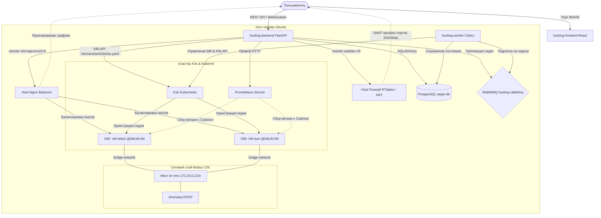

# Панель управления хостингом виртуальных машин ByteBurners Hosting

ByteBurners Hosting — это гиперконвергентная система хостинга виртуальных машин на базе Kubernetes и KubeVirt. Проект объединяет запуск полноценных виртуальных машин (QEMU/KVM), управление сетями через Multus CNI, сбор телеметрии с помощью Prometheus, асинхронную обработку задач через RabbitMQ и автоматическую балансировку входящего трафика с помощью хостового Nginx.

> 📎 **Как компоненты взаимодействуют между собой** (потоки запросов, где что хранится, карта кода, модель безопасности) — см. [ARCHITECTURE.md](ARCHITECTURE.md).

---

## Архитектура системы



---

## Принципы работы платформы

1. **Вычислительные ресурсы (KubeVirt)**
   Виртуальные машины запускаются как стандартные поды Kubernetes с помощью оператора KubeVirt. Это дает изоляцию QEMU/KVM и при этом позволяет управлять жизненным циклом ВМ через декларативные манифесты Kubernetes.

2. **Асинхронные очереди и БД (PostgreSQL + RabbitMQ)**
   Все тяжелые операции (создание, ресайз, миграция, удаление ВМ) не блокируют бэкенд. FastAPI отправляет задачу в очередь **RabbitMQ**, после чего асинхронный воркер **Celery** выполняет команды взаимодействия с Kubernetes. Состояние виртуальных машин и настройки логируются в базе данных **PostgreSQL**.

3. **Сетевое окружение (Multus CNI & DHCP)**
   Для того чтобы виртуальные машины получали IP-адреса из выделенной подсети, на хосте настраивается мост `br-vms` (подсеть `172.20.0.0/24`). Multus CNI пробрасывает виртуальные интерфейсы подов напрямую в этот мост. Служба `dnsmasq` на хост-сервере автоматически раздает машинам IP-адреса по протоколу DHCP.

4. **Ограничение скорости дисков (iotune / QEMU limits)**
   В платформе реализовано ограничение пропускной способности дисков (IOPS и МБ/с) для каждой ВМ на уровне гипервизора QEMU. При создании ВМ бэкенд считывает лимиты из БД и прописывает параметры `disk_read_mbs`, `disk_write_mbs`, `disk_read_iops`, `disk_write_iops` непосредственно в конфигурацию диска манифеста `VirtualMachine`.

5. **Сбор телеметрии (Prometheus)**
   Бэкенд запрашивает метрики процессора, оперативной памяти и дисковой активности напрямую из Prometheus API. Для мгновенной работы опрос выполняется по ClusterIP сервиса Prometheus в сети Kubernetes. Исторические метрики отображаются в деталях каждой ВМ на фронтенде.

6. **Автоматический балансировщик (Nginx Upstream)**
   Панель управления позволяет создавать пулы балансировки в один клик. Бэкенд находит IP-адреса выбранных ВМ в Kubernetes, генерирует конфигурационный файл Nginx в `/etc/nginx/conf.d/` хоста (через пространство имен `/proc/1/root`) и выполняет перезапуск `nginx -s reload` на самом хосте.

7. **Проброс портов и Firewall (iptables)**
   Бэкенд динамически настраивает правила `iptables` в пространстве имен хоста, реализуя проброс входящих портов хоста (например, SSH 22068, HTTP 28068) на внутренние IP-адреса виртуальных машин.

8. **Свои домены и автоматический TLS (Caddy)**
   Приложения живут внутри ВМ за пробросом портов, а не как сервисы Kubernetes, поэтому вместо Ingress используется **Caddy** в контейнере с сетью хоста: он занимает порты 80/443 и одновременно видит IP виртуалок на мосту. Сертификаты Let's Encrypt Caddy выпускает и продлевает сам. Прежде чем домен попадёт в конфиг прокси, проверяются **две** DNS-записи: TXT `_aegis-challenge.<домен>` (подтверждение владения) и A-запись на IP сервера.

9. **Приватный реестр образов (Docker Registry v2)**
   Контейнер `registry:2` на хосте с обязательной аутентификацией (htpasswd/bcrypt). Пароль генерируется при первом запуске, хранится зашифрованным и показан администратору в панели. Панель обходит реестр по HTTP API v2 — список репозиториев, тегов и удаление образов по digest.

10. **Маркетплейс приложений**
    Каталог самодостаточных `docker-compose`-стеков (WordPress, Ghost, Nextcloud, n8n, Uptime Kuma, Vaultwarden, PostgreSQL, Redis). Установка в один клик поднимает выделенную ВМ, cloud-init пишет внутрь `docker-compose.yml` и `.env` и запускает стек. Секреты (пароли БД, admin-токены) генерируются автоматически и показываются один раз.

11. **Мониторинг и оповещения**
    Демон в воркере раз в минуту сверяет метрики (доступность ВМ, CPU и RAM машины или хоста) с правилами и шлёт уведомления в **Telegram** или на **webhook**. Сообщение отправляется только при смене состояния (норма ↔ сработал), поэтому повторов нет.

12. **Резервные копии по расписанию**
    Ежечасные, ежедневные или еженедельные бэкапы ВМ (клон диска через CDI DataVolume) и баз данных (дамп в MinIO) с политикой хранения: лишние копии ротируются автоматически.

13. **Проекты и роли (RBAC)**
    Ресурсы можно объединять в проекты и давать доступ коллегам по ролям: **наблюдатель** (только чтение), **редактор** (управление ресурсами), **владелец** (плюс управление участниками). Ресурсы без проекта остаются личными и ведут себя как раньше.

14. **Доступ по API: токены, CLI и Terraform**
    Персональные токены (`aeg_...`, в БД хранится только SHA-256) позволяют управлять хостингом из скриптов. В комплекте — CLI без зависимостей (`cli/aegis`) и **Terraform-провайдер** (`terraform-provider-aegis`) с ресурсами `aegis_vm` и `aegis_database`.

15. **Защита учётных записей (2FA)**
    Двухфакторная аутентификация по TOTP: подключение по QR-коду, одноразовые резервные коды, проверка кода при входе. Секрет хранится в БД зашифрованным.

---

## Инструкции по установке

Все варианты установки требуют включенную **аппаратную виртуализацию**. Убедитесь, что вывод команды `egrep -c '(vmx|svm)' /proc/cpuinfo` больше 0, и установлен пакет проверки:
```bash
sudo apt-get install -y cpu-checker
kvm-ok
# Вывод должен быть: "INFO: /dev/kvm exists / KVM acceleration can be used"
```

### Вариант 1. Установка на обычный выделенный сервер (Bare Metal или виртуалка)
Это основной путь установки — один скрипт ставит K3s, KubeVirt, Multus, сетевой мост,
Prometheus, LVM-хранилище, спрашивает пароли и сразу поднимает панель.

1. Установите чистую **Ubuntu 22.04 LTS / 24.04 LTS**.
2. Склонируйте репозиторий и запустите установщик от имени root:
   ```bash
   git clone https://github.com/Monopoly450/Hosting.git ~/Hosting
   cd ~/Hosting
   chmod +x install.sh
   sudo ./install.sh
   ```
   В самом начале, сразу после установки пакетов, откроется текстовый мастер
   в рамках (как в raspi-config) и спросит пароли для базы данных, очереди,
   MinIO и токен администратора — на каждый пункт можно просто нажать OK не
   вводя ничего, тогда подставится надёжное случайное значение. После этого
   можно уходить: 10-15 минут установки K3s/KubeVirt идут без вопросов. В
   конце будет напечатан адрес панели и пароль входа.

   Для автоматической установки без вопросов (например, в скрипте разворачивания)
   используйте флаг `--yes`: пароли сгенерируются сами, их можно посмотреть в `.env`.
   ```bash
   sudo ./install.sh --yes
   ```
   > [!TIP]
   > **Проблема с зависанием загрузки K3s с GitHub:**
   > Если скачивание K3s зависает из-за сетевых блокировок, скачайте бинарник на локальный ПК и перекиньте на сервер:
   > 1. На вашем Mac/ПК: `curl -LO https://github.com/k3s-io/k3s/releases/download/v1.36.2+k3s1/k3s && scp k3s root@IP_СЕРВЕРА:/tmp/k3s`
   > 2. На сервере: `mv /tmp/k3s /usr/local/bin/k3s && chmod +x /usr/local/bin/k3s`
   > 3. Запуск на сервере: `INSTALL_K3S_SKIP_DOWNLOAD=true ./install.sh`

   Скрипт безопасно перезапускать: уже выполненные шаги (K3s, KubeVirt и т.п.)
   пропускаются, а к существующему `.env` он не притронется без явного согласия.

---

### Вариант 2. Установка в виртуальной среде Windows Hyper-V
Для развертывания Ubuntu внутри Hyper-V с запуском KubeVirt виртуальных машин внутри нее требуется активировать Nested Virtualization (вложенную виртуализацию) и разрешить спуфинг MAC-адресов на виртуальном сетевом адаптере, иначе внутренняя сеть ВМ будет блокироваться Hyper-V. Это делается на стороне Windows-хоста, `install.sh` внутри гостевой Ubuntu этого не увидит.

1. Создайте виртуальную машину в Hyper-V (например, с именем `Ubuntu-Aegis`) и установите Ubuntu Server.
2. Выключите созданную ВМ.
3. Откройте **PowerShell от имени администратора** на вашем хост-компьютере с Windows и выполните команды:
   ```powershell
   # 1. Включение вложенной виртуализации
   Set-VMProcessor -VMName "Ubuntu-Aegis" -ExposeVirtualizationExtensions $true

   # 2. Разрешение MAC Address Spoofing (чтобы работали виртуальные сетевые карты внутри моста br-vms)
   Set-VMNetworkAdapter -VMName "Ubuntu-Aegis" -MacAddressSpoofing On
   ```
   *(Также разрешить спуфинг MAC-адресов можно через GUI Hyper-V: Параметры ВМ -> Сетевой адаптер -> Дополнительные компоненты -> Включить спуфинг MAC-адресов).*
4. Запустите ВМ в Hyper-V, зайдите по SSH и проверьте доступность KVM:
   ```bash
   kvm-ok
   ```
5. Дальше — как в Варианте 1:
   ```bash
   git clone https://github.com/Monopoly450/Hosting.git ~/Hosting
   cd ~/Hosting
   chmod +x install.sh
   sudo ./install.sh
   ```

---

### Вариант 3. Настройка сервера с публичным ("белым") IP-адресом
Если ваш хост-сервер имеет выделенный публичный статический IP-адрес для внешнего доступа к ВМ — тот же `install.sh`, что и в Варианте 1.

1. Установите систему и запустите установщик:
   ```bash
   chmod +x install.sh
   sudo ./install.sh
   ```
   Скрипт автоматически определит ваш основной внешний сетевой интерфейс (на котором висит белый IP) и настроит правила NAT Masquerade через `iptables`. Когда мастер спросит про внешний адрес — если определённый автоматически адрес совпадает с белым IP, просто нажмите Enter; если сервер за NAT и белый адрес отличается, введите его явно (это ляжет в `AEGIS_HOST_IP`).
2. После создания виртуальной машины в панели:
   * **Для ручного проброса портов**: укажите порты во вкладке настроек ВМ. Система автоматически пробросит порт с вашего белого IP на внутренний IP ВМ.
   * **Для балансировки**: Создайте Балансировочный пул, укажите публичный порт (например, `8090`) и выберите ваши ВМ. Трафик, поступающий на ваш белый IP `http://<белый_IP>:8090`, будет автоматически распределяться между вашими ВМ.

### Вариант 4. Настройка отказоустойчивого 3-нодового кластера (HA Cluster)
Режим высокой доступности объединяет несколько вычислительных нод и общую сетевую СХД. Это позволяет выполнять Живую миграцию (Live Migration) без отключения виртуальных машин и обеспечивает автоматическое восстановление (failover) при выходе из строя одного из физических серверов.

Для развертывания требуются три сервера:
1. **`san-storage`** — выделенная сетевая СХД (NFS-сервер).
2. **`node-1`** — Master-нода Kubernetes (на ней же запускается панель управления Aegis).
3. **`node-2`** — Worker-нода Kubernetes (дополнительный вычислительный узел).

#### Шаг 1. Настройка СХД (`san-storage`)
1. Склонируйте репозиторий на сервер СХД:
   ```bash
   git clone https://github.com/Monopoly450/Hosting.git ~/Hosting
   cd ~/Hosting
   ```
2. Запустите скрипт настройки сетевой шары (он автоматически создаст LVM-диск vg0, смонтирует NFS и раздаст права):
   ```bash
   sudo ./scripts/bootstrap-cluster-storage.sh
   ```

#### Шаг 2. Настройка Master-ноды (`node-1`)
1. Склонируйте репозиторий на `node-1`:
   ```bash
   git clone https://github.com/Monopoly450/Hosting.git ~/Hosting
   cd ~/Hosting
   ```
2. Запустите скрипт настройки мастера. Скрипт установит K3s, Multus, KubeVirt, настроит Helm и автоматически установит службу авто-перезагрузки (Aegis Node Fencer):
   ```bash
   sudo ./scripts/bootstrap-cluster-node1.sh
   ```
   *При запросе введите IP-адрес сервера `san-storage`.*
3. В конце выполнения скрипта скопируйте сгенерированный **K3S Join Token**.
4. Создайте файл конфигурации окружения `.env` и укажите в нем использование сетевого класса хранения:
   ```bash
   cp .env.example .env
   ```
   Откройте `.env` и отредактируйте переменную:
   ```env
   STORAGE_CLASS=nfs-storage
   ```
5. Запустите панель управления:
   ```bash
   docker compose up -d --build
   ```

#### Шаг 3. Настройка Worker-ноды (`node-2`)
1. Запустите скрипт на `node-2` для автоматического присоединения ноды к кластеру:
   ```bash
   git clone https://github.com/Monopoly450/Hosting.git ~/Hosting
   cd ~/Hosting
   sudo ./scripts/bootstrap-cluster-node2.sh
   ```
   *При запросе введите IP-адрес `node-1` и K3S Join Token, полученный на Шаге 2.*

#### Шаг 4. Установка NFS-клиента на нодах
Для того чтобы K3s мог монтировать диски с СХД, на **всех** вычислительных серверах должен быть установлен пакет `nfs-common` (скрипты настройки нод 1 и 2 устанавливают его автоматически). Убедиться в его наличии можно командой:
```bash
sudo apt update && sudo apt install -y nfs-common
```

---


## Автозапуск, хранилище и квоты

`install.sh` уже настраивает автозапуск и хранилище сам — ничего отдельно запускать не нужно. Ниже — что именно он сделал, на случай диагностики.

### Автозапуск служб (systemd)
Для автоматического поднятия виртуальной сети `br-vms`, настройки IPTables NAT и запуска контейнеров панели управления при загрузке ОС хоста, `install.sh` регистрирует две системные службы:
*   `aegis-network.service` — запускается до старта Docker/K3s, создаёт мост `br-vms`, включает маршрутизацию трафика (`ip_forward`) и восстанавливает правила NAT Masquerade.
*   `aegis-hosting.service` — отвечает за автоматический старт и корректное выключение всех Docker Compose контейнеров панели в папке проекта.

Проверка статуса автозапуска:
```bash
sudo systemctl status aegis-network.service
sudo systemctl status aegis-hosting.service
```

### Блочное хранилище LVM (OpenEBS LVM)
Для поддержки **горячей замены дисков (hotplug)** виртуальных машин «на лету» без их остановки, используется OpenEBS LVM LocalPV драйвер — `install.sh` настраивает его автоматически (вызывает `scripts/install-openebs-lvm.sh`). Если после установки диска видите статус `Pending`, а `kubectl describe pvc` — ошибку `exit status 5` (зависшие loop-устройства), перезапустите настройку хранилища вручную:
```bash
sudo bash scripts/install-openebs-lvm.sh
```
**Что делает скрипт:**
1.  Создаёт разреженный (sparse) файл-образ `/var/lib/aegis/lvm-storage.img` размером 40 ГБ. Благодаря разреженной разметке (через `truncate`), файл мгновенно инициализируется и изначально занимает 0 байт на диске хоста, расширяясь только при фактической записи данных виртуалками.
2.  Настраивает systemd-службу `aegis-lvm-loop.service` для автоматического монтирования этого файла как петлевого loop-устройства при загрузке.
3.  Инициализирует группу томов LVM `vg-aegis` и устанавливает драйвер `openebs-lvm` в Kubernetes с автоматическим расширением дисков (`allowVolumeExpansion`).

### Контроль физических ресурсов и квот хоста
При создании виртуальных машин бэкенд платформы выполняет жесткую валидацию ресурсов, гарантируя стабильность работы:
*   **Валидация физических возможностей**: Вы не сможете создать ВМ, ресурсы которой (CPU, RAM, диск) превышают физические возможности самого сервера (количество физических ядер `os.cpu_count()`, общую оперативную память и свободное место на диске).
*   **Учёт резервации**: Система рассчитывает суммарные ресурсы всех запущенных виртуальных машин и не позволяет создавать новые инстансы, если свободный нераспределенный лимит хоста исчерпан.
*   **Квоты студентов**: Студенты больше не привязаны к балансу. Вместо этого в панели администратора каждому пользователю задаются персональные квоты (лимиты CPU, RAM, диска, баз данных и S3 бакетов). При создании ресурсов система проверяет остаток квот пользователя.

### Управление пользователями в панели администратора
Администратор имеет полный контроль над учетными записями:
*   **Редактирование лимитов**: Изменение квот CPU, RAM и дисков для любого пользователя в реальном времени.
*   **Сброс паролей**: Возможность принудительного изменения пароля пользователя администратором.
*   **Самообслуживание**: Любой авторизованный пользователь может самостоятельно сменить свой пароль через виджет в сайдбаре панели.

---

## Обновление запущенной панели

Когда в репозитории появились изменения, на сервере достаточно:
```bash
cd ~/Hosting
git pull
docker compose up -d --build
```
`--build` обязателен, если менялся код бэкенда/фронтенда — иначе Docker переиспользует старый образ. Миграции БД бэкенд применяет сам при старте, вручную запускать не нужно.

Пересобрать можно и один сервис, если менялся только он (например, только фронтенд):
```bash
docker compose up -d --build frontend
```

---

## Справочник портов и учетных записей (Cheatsheet)

Для быстрого администрирования, тестирования и отладки ниже приведены все стандартные доступы, адреса и пароли.

Все пароли и токены задаются в файле `.env` (см. `.env.example`). В репозитории и README реальные значения не хранятся.

### 1. Веб-интерфейсы платформы
* **Панель администратора Aegis**: 
  * HTTP: `http://<IP_СЕРВЕРА>:8080`
  * HTTPS: `https://<IP_СЕРВЕРА>:8443`
  * Токен: значение `ADMIN_TOKEN` из `.env`
* **Кабинет пользователя VDS**: 
  * HTTP: `http://<IP_СЕРВЕРА>:8081`
  * HTTPS: `https://<IP_СЕРВЕРА>:8444`
* **Веб-интерфейс почты (Roundcube Webmail)**:
  * HTTP: `http://<IP_СЕРВЕРА>:8082`
* **Документация API (Swagger)**:
  * Swagger UI: `http://<IP_СЕРВЕРА>:8000/docs`

Контейнеры, которые панель поднимает сама (не через `docker-compose`, а по кнопке в интерфейсе):

* **Приватный реестр образов** — контейнер `aegis-registry`, порт `5000` (меняется через `REGISTRY_PORT`).
  Требует авторизации: логин `aegis`, пароль показан на вкладке «Контейнерный реестр».
  Работает по HTTP, поэтому на клиенте добавьте его в `insecure-registries` (`/etc/docker/daemon.json`).
* **Прокси своих доменов** — контейнер `aegis-caddy`, порты `80` и `443` хоста.
  Порт 80 нужен для HTTP-01 проверки Let's Encrypt, поэтому дефолтный сайт nginx на нём отключается
  (сам nginx продолжает работать — он обслуживает пулы балансировщика).
  Оба порта должны быть доступны из интернета, иначе сертификат не выпустится.

### 2. Системная база данных (PostgreSQL)
База данных хранит метаданные пользователей, тарифов, ВМ и дисков. Секреты (пароли внешних серверов, пароли пользовательских БД, ключи S3) хранятся в ней в зашифрованном виде (ключ — `AEGIS_SECRET_KEY` из `.env`).
* **Имя контейнера**: `aegis-db`
* **Порт**: `5432`, доступен **только с localhost** (снаружи закрыт)
* **Имя БД**: `aegis`
* **Пользователь**: `postgres`, пароль — `POSTGRES_PASSWORD` из `.env`
* **Как подключиться изнутри контейнера**:
  ```bash
  docker exec -it aegis-db psql -U postgres -d aegis
  ```
* **Как подключиться с хоста**:
  ```bash
  PGPASSWORD="$POSTGRES_PASSWORD" psql -h 127.0.0.1 -U postgres -d aegis
  ```

### 3. Объектное хранилище (MinIO S3)
* **Имя контейнера**: `aegis-minio`
* **S3 API Endpoint** (порт подключения программ): `9000` (например, `http://<IP_СЕРВЕРА>:9000`)
* **Веб-панель управления (MinIO Console)**: `9001`, доступна **только с localhost**. С рабочей машины откройте SSH-туннель:
  ```bash
  ssh -L 9001:127.0.0.1:9001 root@<IP_СЕРВЕРА>   # затем http://localhost:9001
  ```
* **Корневой администратор MinIO**: логин/пароль — `MINIO_ROOT_USER` / `MINIO_ROOT_PASSWORD` из `.env`
* **Как проверить список сервисных аккаунтов пользователей на сервере**:
  ```bash
  docker exec -it aegis-minio mc admin user svcacct list local minioadmin
  ```

### 4. Очередь сообщений (RabbitMQ)
* **Имя контейнера**: `hosting-rabbitmq`
* **Порты**: `5672` (AMQP) и `15672` (Management Console) — доступны **только с localhost**; для веб-консоли используйте SSH-туннель аналогично MinIO
* **Логин / Пароль**: `RABBITMQ_USER` / `RABBITMQ_PASS` из `.env` (если не заданы — `guest`/`guest`, который RabbitMQ и так пускает только с localhost)

### 5. Проверка динамического доступа к базам данных
Пользовательские базы данных запускаются в изолированных подах Kubernetes. Доступ к базе регулируется NetworkPolicy: при привязке базы к ВМ в панели Aegis трафик разрешается только от этой ВМ. Адрес подключения (`db-service-<имя_БД>`) отображается в панели.

* **Как протестировать доступ к PostgreSQL из привязанной гостевой ВМ**:
  ```bash
  PGPASSWORD='<ПАРОЛЬ_БД>' psql -h <АДРЕС_БД_ИЗ_ПАНЕЛИ> -U <ПОЛЬЗОВАТЕЛЬ_БД> -d <ИМЯ_БД> -c "SELECT 1;"
  ```
* **Как протестировать доступ к MySQL/MariaDB из привязанной гостевой ВМ**:
  ```bash
  mysql -u <ПОЛЬЗОВАТЕЛЬ_БД> -p'<ПАРОЛЬ_БД>' -h <АДРЕС_БД_ИЗ_ПАНЕЛИ> -D <ИМЯ_БД> -e "SELECT 1;"
  ```

### 6. Тесты бэкенда
```bash
cd backend
pip install -r requirements-dev.txt
pytest tests/
```
Сейчас это 165 тестов в 15 файлах. Помимо шифрования и авторизации они закрепляют
логику, которую легко сломать незаметно: матрицу ролей RBAC (наблюдатель читает,
но не изменяет), расчёт времени следующего бэкапа, стейт-машину алертов, проверку
TOTP по эталонному вектору RFC, генерацию Caddyfile и валидацию доменов, а также
защиты по итогам аудита — блокировку SSRF, обход каталога в реестре, инъекцию в
`.env` и маскировку серверных ошибок.

> Тесты проверяют логику, но **не** доказывают работоспособность на реальном
> кластере. Для этого есть отдельный чеклист живой проверки: [`VERIFICATION.md`](VERIFICATION.md).
